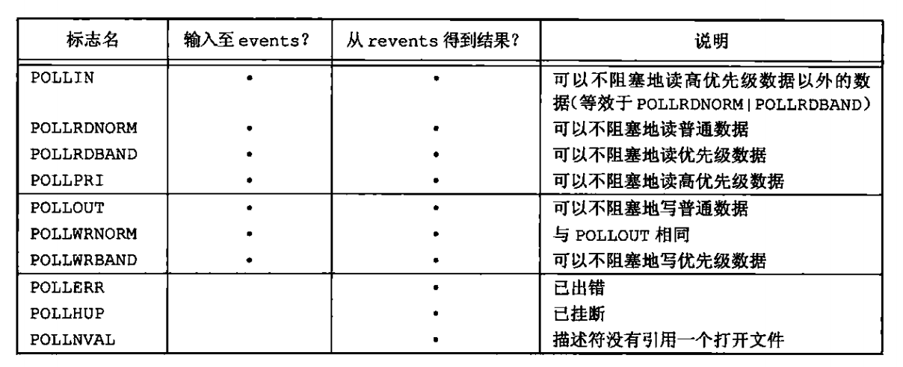
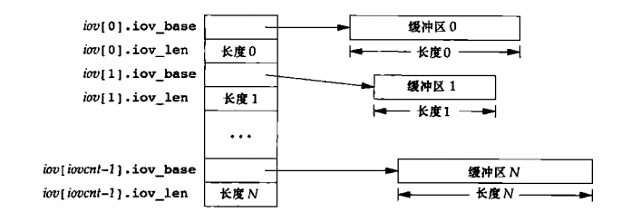

# 13 高级I/O

## 13.1 引言

本章涵盖众多概念和函数，我们把它们统统放在高级I/O下讨论，非阻塞I/O、记录锁、I/O多路转接（select和poll函数）、异步I/O、readv和writev函数以及储存映射（mmap）。第15章和第17章中的进程间通信以及以后各章中的很多实例都要使用本章所描述的概念和函数。

## 13.2 非阻塞I/O

系统调用可以分为两类：“低速”系统调用和其他。低速系统调用时可能会使进程永远阻塞的一类系统调用，包括：
* 如果某些文件类型（如读管道、终端设备和网络设备）的数据不存在，读操作可能会使调用者永远阻塞；
* 如果数据不能被相同的文件类型立即接受（如管道中无空间、网络流控制），写操作可能会使调用者永远阻塞；
* 在某些条件发生前打开某些文件类型可能发生阻塞（如要打开一个终端设备，需要先等待与之连接的调制解调器应答，又如若以只写模式打开FIFO，那么在没有其他进程已用读模式打开该FIFO时也要等待）；
* 对已经加上强制性记录锁的文件进行读写；
* 某些ioctl操作；
* 某些进程间通信函数。

我们也曾说过，虽然读写磁盘文件会暂时阻塞调用者，但是并不能将与磁盘I/O有关的系统调用视为“低速”。

非阻塞I/O使我们可以发出open、read和write这样的I/O操作，并是这些操作不会永远阻塞。如果这种操作不能完成，则调用立即出错返回，表示该操作如继续执行将阻塞。

对于一个给定的描述符，有两种为其制定非阻塞I/O的方法。

1. 如果调用open获得描述符，则可制定O_NONBLOCK标志。
2. 对于已经打开的描述符，泽科调用fcntl，由该函数打开O_NONBLOCK文件状态标志。

## 13.3 记录锁

当两个人同时编辑一个文件时，其后果将如何呢？在大多数UNIX系统中，该文件的最后状态取决于写该文件的最后一个进程。但是对于有些应用程序，如数据库，进程有时需要确保它正在单独写一个文件。为了向进程提供这种功能，商用UNIX系统提供记录锁机制。

记录锁的功能是：当第一个进程正在读或修改文件的某个部分时，使用估计卢梭可以阻止其它进程修改同一文件区。对于UNIX而言，“记录”这个词是一种误用，因为UNIX系统内核根本没有使用文件记录这种概念。一个更适合的术语可能是字节范围锁，因为它锁定的只是文件中的一个区域（也可能是整个文件）。

fcntl记录锁

在之前已经给出了fcntl的原型，这里再重复一次
```c
    #include <unistd.h>
    #include <fcntl.h>
    int fcntl(int fd, int cmd, ... /* arg */ );
```
对于记录锁，cmd是F_GETLK、F_SETLK或F_SETLKW。第三个参数（我们将调用flockptr）是一个指向flock结构的指针。
```c
    struct flock {
        ...
        short l_type;    /* Type of lock: F_RDLCK,
                            F_WRLCK, F_UNLCK */
        short l_whence;  /* How to interpret l_start:
                            SEEK_SET, SEEK_CUR, SEEK_END */
        off_t l_start;   /* Starting offset for lock */
        off_t l_len;     /* Number of bytes to lock */
        pid_t l_pid;     /* PID of process blocking our lock
                            (set by F_GETLK and F_OFD_GETLK) */
        ...
    };
```

上面提到了两种类型的锁：共享读锁和独占写锁。基本规则是：任意多个进程在一个给定的自己额上可以有一把共享的读锁，但是在一个给定字节上只能有一个进程有一把独占写锁。进一步而言，如果在一个给定字节上已经有一把或多把读锁，则不能再该字节上再加写锁；如果在一个字节上已经有一把独占写锁，则不能再对它加任何读锁。

如果两个进程都在等待对方持有并且不释放的资源时，则这两个进程处于死锁状态。如果一个进程已经控制了文件中的一个加锁区域，然后它有试图对另一个进程控制的区域加锁，那么他就会休眠，在这种情况下，有发生死锁的可能性。

关于锁的自动继承和释放有3条规则。

1. 锁与进程和文件两者相关联。
2. 由fork产生的子进程不继承父进程所设置的锁。
3. 在执行exec后，新程序可以继承原先执行程序的锁。

## 13.4 I/O多路转接

当从一个描述符读，然后又写入到另一个描述符时，可以在下列形式的循环中使用阻塞I/O：
```c
    while((n == read(STDIN_FILENO, buf, BUFSIZ)) > 0)
        if(write(STDOUT_FILENO, buf, n) != 0)
            err_sys("write error");
```
这种形式的阻塞I/O导出课件。但是如果必须从两个描述符读，又将如何呢？在这种情况下，我们不能在任一个描述符上进行阻塞读（read），否则可能会因为被阻塞在一个描述符的读操作上而导致另一个描述符也无法处理。所以为了处理这种情况需要另一种不同的技术。让我们观察telnet(1)命令的结构，该程序从终端（标准输入）读，将所得数据写入到网络连接上，同时从网络连接读，将所得数据写到终端上（标准输出）。在网络另一端，telnetd守护进程读用户键入的命令，并将所读到的送给shell，这如同用户登录到远程机器一样。telnetd守护进程将执行用户键入命令而产生的输出通过telnet命令送回给用户，并显示在用户终端上。
<div align=center>


telnet程序概观
</div>

telnet进程有两个输入两个输出。我们不能对两个输出中任何一个使用阻塞read，因为我们不知道到底哪个输入会得到数据。处理这种问题的方法是，将一个进程变成两个进程（用fork），每个进程处理一条数据通路。下图显示了这种安排。
<div align=center>


telnet使用两个进程实现telnet程序
</div>

如果使用两个进程，则可使每个进程都执行阻塞read。但这也产生了问题：操作什么时候终止？如果子进程收到文件结束符（telnetd守护进程使网络连接断开），那么该子进程终止，然后父进程接收到SIGCHLD信号。但是如果父进程终止（如SIGUSR1），但这使程序更加复杂。

我们可以选择不使用两个进程而使用一个进程中的两个线程。虽然避免了终止的复杂性，但却要求处理两个线程之间的同步，在复杂性方面得不偿失。

另一种方法是仍旧使用一个进程来执行改程序，但使用非阻塞I/O读取数据，采用轮询的方式来查看是否有数据可读，但是大多数情况下是浪费的。

还有一种技术称之为异步I/O(asynchronous I/O)。利用这种技术，进程告诉内核：当描述符装备好可以I/O时，用一个信号通知它。这种技术有两个问题。首先，尽管一些系统提供了各自的受限形式的异步I/O，但POSIX采纳了另外一套标准化接口，所以可移植性成为一个问题。

这种技术的第二个问题是，这种信号对每个进程而言只有1个（SIGPOLL或SIGIO）。如果使该信号对两个描述符都起作用，那么在接到这个信号时将无法判断是哪一个描述符准备好了。虽然POSIX.1异步I/O接口允许选择哪个信号作为通知，但能使用的信号数量远少于潜在的打开文件描述符数量。为了确定是哪一个描述符准备好了，仍需要将这两个描述符设置为非阻塞的，并顺序执行I/O。

一种比较好的技术是使用I/O多路转接（I/O multiplexing）。为了使用这种技术，先构建一张我们感兴趣的描述符（通常都不止一个）的列表，然后调用一个函数，知道这些描述符中的一个已准备好进行I/O时，该函数才返回。poll，pselect和select这3个函数使我们能够执行I/O多路转接。再从这些函数返回时，进程会被告知那些描述符已经准备好进行I/O

### 13.4.1 函数select和pselect

在所有的POSIX兼容平台上，select函数使我们可以执行I/O多路转接。传给select的参数高速内核：

* 我们关心的描述符；
* 对于每一个描述符我们关心的条件（是否想从一个给定的描述符读，是否想写一个给定的描述符，是否关心一个给定的描述符的异常条件）；
* 愿意等待多长时间（可以永远等待、等待一个固定的时间或者根本不等待）。

从select返回时，内核告诉我们：

* 已准备好描述符的总数量；
* 对于读、写或异常这3个条件中的每一个，那些描述符已准备好。

使用这种返回信息，就可以调用相应的I/O函数（一般是read或write），并且确知该函数不会阻塞。

```c
    /* According to POSIX.1-2001, POSIX.1-2008 */
    #include <sys/select.h>

    /* According to earlier standards */
    #include <sys/time.h>
    #include <sys/types.h>
    #include <unistd.h>

    int select(int nfds, fd_set *readfds, fd_set *writefds,
               fd_set *exceptfds, struct timeval *timeout);

    void FD_CLR(int fd, fd_set *set);
    int  FD_ISSET(int fd, fd_set *set);
    void FD_SET(int fd, fd_set *set);
    void FD_ZERO(fd_set *set);

    #include <sys/select.h>

    int pselect(int nfds, fd_set *readfds, fd_set *writefds,
                fd_set *exceptfds, const struct timespec *timeout,
                const sigset_t *sigmask);
```
对于“准备好”的含义要做一些更具体的说明。
+ 若对读集中的一个描述符进行read操作不会阻塞，则认为此描述符是准备好的；
+ 若对写集中的一个描述符进行write操作不会阻塞，则认为此描述符是准备好的；
+ 若对异常条件集中的一个描述符有一个未决操作，则认为此描述符是准备好的。现在，异常条件包括：在网络连接上到达带外数据，或者处于数据包模式的伪终端上发生了某些条件；
+ 对于读、写和异常条件，普通文件的文件描述符总是返回准备好。

### 13.4.2 函数poll

poll函数类似于select，但是程序接口有所不同，poll函数可用于任何类型的文件描述符。
```c
    #include <poll.h>

    int poll(struct pollfd *fds, nfds_t nfds, int timeout);

    #define _GNU_SOURCE         /* See feature_test_macros(7) */
    #include <signal.h>
    #include <poll.h>

    int ppoll(struct pollfd *fds, nfds_t nfds,
            const struct timespec *tmo_p, const sigset_t *sigmask);
```
与select不同，poll不是为每个条件（可读性、可写性和异常条件）构造一个描述符集，而是构造一个pollfd结构的数组，每个数组元素指定一个描述符编号以及我们队该描述符感兴趣的条件。
```c
    struct pollfd {
        int   fd;         /* file descriptor */
        short events;     /* requested events */
        short revents;    /* returned events */
    };
```
fds中元素的数目由nfds指定。

应将每个数组元素的events成员设置为下图中的一个或几个，通过这些值高速内核我们关心的是每个描述符的那些事件。返回时，revents成员由内核设置，用于说明每个描述符发生了那些事情。
<div align=center> 



poll的events和revents标志
</div>

当一个描述符被挂断后（POLLHUP），就不能再写该描述符，但是有可能仍然可以从该描述符读取到数据。

poll的最后一个参数制定的是我们愿意等待多长时间。如同select一样。有三种不同的情形。

与select一样，一个描述符是否阻塞不会影响poll是否阻塞。

## 13.5 异步I/O

使用上一节说的select和poll可以实现异步形式的通知。关于描述符的状态，系统并不主动告诉我们任何信息，我们需要查询（调用select和poll）。信号机构提供了一种以异步形式的异步I/O，使用一个信号通知进程，对某个描述符关心的事件已经发生。我们在前面提到过，这种形式的异步I/O是受限制的：它们不能使用在所有的文件类型上，而且只能用一个信号。如果要对一个以上的描述符进行异步I/O，那么进程收到该信号时并不知道这一信号对应哪一个描述符。

在我们了解使用异步I/O的不同方法之前，需要先讨论下成本。在用异步I/O的时候，要通过选择来灵活处理多个并发操作，这会使得程序的设计复杂化。更简单的做法可能是使用多线程，使用同步模型来编写程序，并让这些线程以异步的方法运行。

使用POSIX异步I/O接口，会带来以下麻烦：

* 每个异步操作有3处可能产生错误的地方：一处在操作提交的部分，一处在操作本身的结果，还有一处在用于决定异步操作状态的函数中。
* 与POSIX异步I/O接口的传统方法相比，它们本身设计大量额外设置和处理规则。
* 从错误中恢复可能会比较困难。

### System V 异步I/O

### BSD 异步I/O

在BSD派生的系统中，异步I/O是信号SIGIO和SIGURG的组合。SIGIO是通过异步I/O信号，SIGURG则只是用来通知进程网络连接上的带外数据已经到达。

为了接收SIGIO信号，需要执行以下3步：
1. 调用signal或者sigaction为SIGIO信号建立信号处理程序；
2. 以命令F_SETOWN调用fcntl来设置进程ID或进程组ID，用于接收对于该描述符的信号；
3. 以命令F_SETFL调用fcntl设置O_ASYNC文件标志，使该描述符上可以进行异步I/O。

第3步仅能对指向终端或网络的描述符执行，这是BSD异步I/O设施的一个基本限制。

对于SIGURG信号，只需执行第1步和第2步。该信号仅对引用支持带外数据的网络连接符而产生，如TCP连接。

## 13.6 函数readv和writev

readv和writev函数用于在一次函数调用中读、写多个非连续缓冲区。有时也将这两个函数称为散布读和聚集写。
```c
    #include <sys/uio.h>

    ssize_t readv(int fd, const struct iovec *iov, int iovcnt);

    ssize_t writev(int fd, const struct iovec *iov, int iovcnt);

    ssize_t preadv(int fd, const struct iovec *iov, int iovcnt,
                   off_t offset);

    ssize_t pwritev(int fd, const struct iovec *iov, int iovcnt,
                    off_t offset);
```
该函数的第二个参数是指向iovec结构数组的一个指针：
```c
    struct iovec {
        void  *iov_base;    /* Starting address */
        size_t iov_len;     /* Number of bytes to transfer */
    };
```
<div align=center>



readv和writev的iovec结构
</div>
readv函数则将读入的数据按上述顺序散布到缓冲区中。readv总是先填满一个缓冲区，然后再填写下一个。readv返回读到的字节总数。如果遇到文件尾端，已无数据可读，则返回0。

## 13.7 函数readn和writen

管道、FIFO以及某些设备（特别是终端设备和网络）有下列两种性质。

1. 一次read操作所返回的数据可能少于所要求的数据，即使还没达到文件尾端也可能是这样，这不是一个错误，应当继续读该设备。
2. 一次write操作的返回值也可能少于指定的输入字节数。这可难是由某个因素造成的，例如，内核输出缓冲区变满。这也不是错误，应当继续写余下的数据。

下面两个函数readn和writen的功能分别是读、写指定的N个字节数据，并处理返回值可能小于要求值的情况。这两个函数只是按需多次调用read和write直至读、写了N个字节。
```c
    ssize_t readn(int fd, void *buf, size_t nbytes);
    ssize_t writen(int fd, void *buf, size_t nbytes);
```

## 13.8 储存映射I/O

储存映射I/O能将一个磁盘文件映射到储存空间中的一个缓冲区上，于是，从缓冲区中读取数据时，就相当于读文件中的相应字节。于此类似，将数据存入缓冲区时，相应的字节就自动写入文件。这样就可以在不调用read和write的情况下执行I/O。

为了使用这个功能，应首先告诉内核将一个给定文件映射到一个储存区中。这是由mmap函数实现的。
```c
    #include <sys/mman.h>

    void *mmap(void *addr, size_t length, int prot, int flags,
               int fd, off_t offset);
    int munmap(void *addr, size_t length);
```
与储存区相关的信号有SIGSEGV和SIGBUS。信号SIGSEGV通常用于指示进程视图访问对它不可用的储存区。如果映射储存区被mmap指定成了可读的，那么进程视图将数据存入这个意思储存区的时候，也会产生此信号。如果映射区的某个部分访问时已不存在，则产生SIGBUS信号。

子进程可以通过fork继承储存映射区（因为子进程复制父进程地址空间，而储存映射区是该地址空间的一部分），但是由于同样的原因，新程序不能通过exec继承储存映射区。

当进程终止时，会自动解除储存映射区的映射，或者直接调用munmap函数也可以解除映射区。关闭映射储存区时使用的文件描述符并不解除映射区。munmap并不影响被映射的对象，也就是说，调用munmap并不会使映射区的内容写到磁盘文件上。对于MAP_SHARED区磁盘文件的更新，会在我们将数据谢安东储存映射区后某个时刻，按内核虚拟储存算法自动进行。在储存区解除映射后，对MAP_PRIVATE储存区的修改会被丢弃。