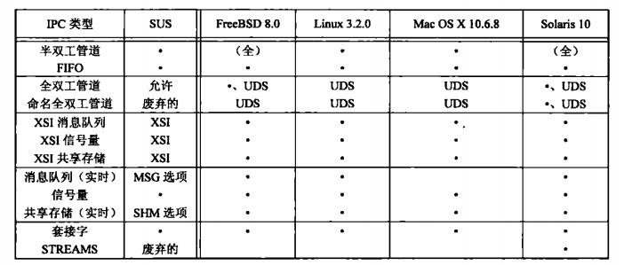
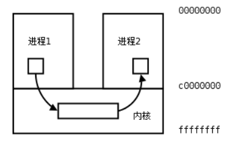

# 14  进程间通信（IPC，Inter-Process Communication）

## 14.1 引言

在之前章节说明了进程控制原语，并且观察了如何调用多个进程。但这些进程之间交换信息的唯一途径就是传送打开文件，可以经由fork和exec来传送，也可以通过文件系统来传送，本章将说明进程之间互相通信的其他技术——进程间通信（InterProcess Communication，IPC）。

下图列出了本书讨论的4种实现所支持的不同形式IPC。

<div align=center>



UNIX系统IPC摘要
</div>
在上图中前10种IPC形式仅限于同一主机的两个进程之间的IPC。最后两行（套接字和STREAMS）是仅有的支持不同主机上两个进程间IPC的两种形式

每个进程各自有不同的用户地址空间，任何一个进程的全局变量在另一个进程中都看不到，所以进程之间要交换数据必须通过内核，在内核中开辟一块缓冲区，进程1把数据从用户空间拷到内核缓冲区，进程2再从内核缓冲区把数据读走，内核提供的这种机制称为进程间通信（IPC，InterProcess Communication）。

<div align=center>



"进程间通信"

</div>

## 14.2 pipe管道

管道是UNIX系统IPC的最古老形式，所有UNIX系统都提供此种通信方式。管道有以下两种局限性：
1. 历史上，他们是半双工的（即数据只能在一个方向上流动）。现在，某些系统提供全双工管道，但是为了可移植性，我们绝不应预先假定系统提供全双工管道。
2. 管道只能在具有公共祖先的两个进程间使用。通常一个管道由一个进程创建，在进程调用fork后，这个管道就能在父进程和子进程之间使用了。

```c 
        #include <unistd.h>
        int pipe(int filedes[2]);
        //返回值：若成功，返回0，若出错，返回-1
```

管道作用于有**血缘关系**的进程之间,通过fork来传递调用pipe函数时在内核中开辟一块缓冲区（称为管道）用于通信，它有一个读端一个写端，然后通过filedes参数传出给用户程序两个文件描述符，filedes[0]指向管道的读端，filedes[1]指向管道的写端（很好记，就像0是标准输入1是标准输出一样）。所以管道在用户程序看起来就像一个打开的文件，通过read(filedes[0])或者write(filedes[1]);向这个文件读写数据其实是在读写内核缓冲区。
        
开辟了管道之后如何实现两个进程间的通信呢？比如可以按下面的步骤通信。
        
1.父进程调用pipe开辟管道，得到两个文件描述符指向管道的两端。
2.父进程调用fork创建子进程，那么子进程也有两个文件描述符指向同一管道。
3.父进程关闭管道读端，子进程关闭管道写端。父进程可以往管道里写，子进程可以从管道里读，管道是用环形队列实现的，数据从写端流入从读端流出，这样就实现了进程间通信。
<div align=center>


管道的用法
</div>

__父写子读： 关闭父读，关闭子写__

__子写父读： 关闭子读，关闭父写__

例 pipe管道

```c
    #include <stdlib.h>
    #include <unistd.h>
    #define MAXLINE 80
    int main(void)
    {
        int n;
        int fd[2];
        pid_t pid;
        char line[MAXLINE];
        if (pipe(fd) < 0) {
            perror("pipe");
            exit(1);
        }
        if ((pid = fork()) < 0) {
            perror("fork");
            exit(1);
            }
        if (pid > 0) { /* parent */
            close(fd[0]);
            write(fd[1], "hello world\n", 12);
            wait(NULL);
            } 
        else { /* child */
            close(fd[1]);
            n = read(fd[0], line, MAXLINE);
            write(STDOUT_FILENO, line, n);
        }
        return 0;
    }
```
总结

ls -l | grep "name"     **使用示例**

pipe用于有血缘关系的进程之间，通过fork来传递      **fork(fd[2])**

文件描述符在父子进程之间传递，但相同的文件描述符对应唯一的file结构体（公用读写指针位置）

写端关闭，读端读完管道里的内容时，再次读，返回0，相当于EOF

写端未关闭，写端暂无数据，读端读完管道数据时，再次读，阻塞

读端关闭，写端写管道，产生SIGPIPE信号，写进程默认情况下会终止进程

读端未读管道，写端写满管道后，再次写，阻塞

使用管道有一些限制：

两个进程通过一个管道只能实现单向通信，比如上面的例子，父进程写子进程读，如果有时候也需要子进程写父进程读，就必须另开一个管道。请读者思考，如果只开一个管道，但是父进程不关闭读端，子进程也不关闭写端，双方都有读端和写端，为什么不能实现双向通信？

管道的读写端通过打开的文件描述符来传递，因此要通信的两个进程必须从它们的公共祖先那里继承管道文件描述符。上面的例子是父进程把文件描述符传给子进程之后父子进程之间通信，也可以父进程fork两次，把文件描述符传给两个子进程，然后两个子进程之间通信，总之需要通过fork传递文件描述符使两个进程都能访问同一管道，它们才能通信。

使用管道需要注意以下4种特殊情况（假设都是阻塞I/O操作，没有设置O_NONBLOCK标志）：
1.如果所有指向管道写端的文件描述符都关闭了（管道写端的引用计数等于0），而仍然有进程从管道的读端读数据，那么管道中剩余的数据都被读取后，再次read会返回0，就像读到文件末尾一样。

2.如果有指向管道写端的文件描述符没关闭（管道写端的引用计数大于0），而持有管道写端的进程也没有向管道中写数据，这时有进程从管道读端读数据，那么管道中剩余的数据都被读取后，再次read会阻塞，直到管道中有数据可读了才读取数据并返回。

3.如果所有指向管道读端的文件描述符都关闭了（管道读端的引用计数等于0），这时有进程向管道的写端write，那么该进程会收到信号SIGPIPE，通常会导致进程异常终止。讲信号时会讲到怎样使SIGPIPE信号不终止进程。

4.如果有指向管道读端的文件描述符没关闭（管道读端的引用计数大于0），而持有管道读端的进程也没有从管道中读数据，这时有进程向管道写端写数据，那么在管道被写满时再次write会阻塞，直到管道中有空位置了才写入数据并返回。

管道的这四种特殊情况具有普遍意义。

非阻塞管道, fcntl函数设置O_NONBLOCK标志

fpathconf(int fd, int name)测试管道缓冲区大小，**PC_PIPE**

## 14.3 函数popen和pclose

常见操作是创建一个连接到另一个进程的管道，然后读其输出或向其输入端发送数据，为此，标准I/O库提供了两个函数popen和pclose。这两个函数的操作是：创建一个管道，fork一个子进程，关闭未使用的管道端，执行一个shell运行命令，然后等待命令终止。
```c
    #include <stdio.h>

    FILE *popen(const char *command, const char *type);
    //返回值：若成功，返回文件指针；若出错，返回NULL
    int pclose(FILE *stream);
    //返回值：若尘共，返回cmdstring的终止状态；若出错，返回-1
```
popen先执行fork，然后调用exec执行cmdstring，并且返回一个标准I/O文件指针。如果type是“r”，则文件指针连接到cmdstring的标准输出。

如果type是“w”，则文件指针连接到cmdstring的标准输入。

pclose函数关闭标准I/O流，等待命令终止，然后返回shell的终止状态。如果shell不能执行，则pclose返回的终止状态与shell已执行exit（127）一样。

## 14.4 协同进程

UNIX系统过滤程序从标准输入读取数据，向标准输出写数据。几个过滤程序通常在shell管道中线性连接。当一个过滤程序既产生某个过滤程序的输入，又读取该过滤程序的输出时，它就变成了协同进程。

popen只提供连接到另一个进程标准输入或标准输出的一个单向管道，而协同进程则有连接到另一个进程的两个单向管道：一个接到标准输入，另一个来自其标准输出。我们想将数据铣刀其标准输入，经处理后，从其标准输出读取数据。

## 14.5 FIFO

IFFO有时被称为命名管道。未命名的管道只能在两个相关的进程间使用，而且这两个相关的进程还要有一个共同的创建了它们的祖先进程。但是通过FIFO，不相关的进程也可以交换数据。在高级I/O章节中已经提到了FIFO是一种文件类型。通过stat的st_mode成员编码可以知道是否是FIFO类型。可以用S_ISFIFO宏进程测试。

创建FIFO类似于创建文件。确实，FIFO的路径名存在于文件系统中，mkfifo 既有命令也有函数。

```c
    #include <sys/types.h>
    #include <sys/stat.h>
    int mkfifo(const char *pathname, mode_t mode);
```
类似于管道，若write一个尚无进程为读而打开的FIFO，则产生信号SIGPIPE。若某个FIFO最后一个写进程关闭了该FIFO，则将为该FIFO的读进程产生一个文件结束标志。一个给定的FIFO有多个写进程是很常见的，这就意味着，如果不希望多个进程所写的数据交叉，则必须考虑原子写操作。和管道一样，常量PIPE_BUF说明了可被原子写到FIFO的最大数据量。

### 实例：用FIFO复制输出流

### 实例：使用FIFO进行客户端进程-服务器进程通信

## 14.6 XSI IPC

有3种称作XSI IPC的IPC：消息队列、信号量以及共享储存器。他们之间有很多相似之处。本节先介绍它们相似的特征，后面几节将说明这些IPC各自的特殊功能。

### 15.6.1 标识符和键

每个内核中的IPC结构（消息队列、信号量或共享储存段）都用一个非负整数的标识符加以引用。与文件描述符不同，IPC标识符不是小的整数。当一个IPC结构被创建，然后又被删除时，与此种结构相关的标识符连续加1，知道达到一个整形数最大值，然后又回归为0。

标识符是IPC对象的内部名，为了使多个进程能够在同一IPC对象上汇聚，需要提供一个外部命名方案。为此每个IPC对象都与一个键（key）相关联，将这个键作为该对象的外部名。

有多重方法使客户进程和服务器进程在同一IPC上汇聚：
1. 服务器进程可以指定键IPC_PRIVATE创建一个新IPC结构，将返回标识符存放在某处（如一个文件）以便客户进程取用。键IPC_PRIVATE保证服务器进程创建一个新IPC结构。这种技术的缺点是：文件系统操作需要服务器进程将整形标识符写到文件中，此后客户进程又要读这个文件取得此标识符。
2. 可以在一个公用头文件中定义一个客户进程和服务器进程都认可的键。然后服务器进程指定此键创建一个新的IPC结构。这种方法的问题是该键可能已与一个IPC结构相结合，在此情况下，get函数出错返回。服务器必须处理这一情况。
3. 客户进程和服务器进程认可同一路径名和项目ID（项目ID是0-255之间的值），接着，调用ftok将这两个值变换成一个键。然后在方法（2）中使用此键。ftok提供的唯一服务就是由一个路径名和项目ID产生一个键。
```c
    #include <sys/types.h>
    #include <sys/ipc.h>

    key_t ftok(const char *pathname, int proj_id);
    //返回值：若成功，返回键；若出错，返回（key_t）-1
```

### 14.6.2 权限结构

XSI IPC为每个IPC结构关联了一个ipc_perm结构。该结构规定了权限和所有者。在创建IPC结构时，对所有字段赋值。以后可以调用msgctl、semctl或shmctl修改uid，git和mode字段。为了修改这些值，调用进程必须是IPC结构的创建者或者超级用户。修改这些字段类似于对文件调用chown和chmod。

### 14.6.2 结构限制

所有3种形式的XSI IPC都有内置限制。大多数限制可以通过重新配置内核来改变。

### 14.6.4 优点和缺点

## 14.7 消息队列

消息队列是消息的链接表，储存在内核中，有消息队列标识符标识。在本节中，我们把消息队列称为队列，其标识符简称队列ID。

msgget用于创建一个新的队列或打开一个现有队列。msgsnd将新消息添加到队列尾端。每个消息包含一个正的长整数类型的字段、一个非负的长度以及实际数据字节数（对应于长度），所有这些都在消息添加到队列式，传送给msgsnd。msgrcv用于从队列中取消息。我们并不一定概要以先进先出次序取消息，也可以按照消息类型字段取消息。每个队列都有一个msqid_ds结构与其相关联。
```c
    struct msqid_ds {
        struct ipc_perm msg_perm;     /* Ownership and permissions */
        time_t          msg_stime;    /* Time of last msgsnd(2) */
        time_t          msg_rtime;    /* Time of last msgrcv(2) */
        time_t          msg_ctime;    /* Time of last change */
        unsigned long   __msg_cbytes; /* Current number of bytes in
                                         queue (nonstandard) */
        msgqnum_t       msg_qnum;     /* Current number of messages
                                         in queue */
        msglen_t        msg_qbytes;   /* Maximum number of bytes
                                         allowed in queue */
        pid_t           msg_lspid;    /* PID of last msgsnd(2) */
        pid_t           msg_lrpid;    /* PID of last msgrcv(2) */
    };
```
调用的第一个函数通常是msgget，其功能是打开一个现有的队列或创建一个新队列。
```c
    #include <sys/types.h>
    #include <sys/ipc.h>
    #include <sys/msg.h>

    int msgget(key_t key, int msgflg);
    //返回值：若成功，返回消息队列ID；若出错，返回-1
```
若执行成功，msgget返回非负队列ID。此后，该值就可被用于其他3个队列消息函数。

msgctl函数对队列执行多种操作。它与另外两种信号量及共享储存有关的函数（semctl和shmctl）都是XSI IPC的类似于ioctl的函数（亦即垃圾桶函数）。

    #include <sys/types.h>
    #include <sys/ipc.h>
    #include <sys/msg.h>

    int msgctl(int msqid, int cmd, struct msqid_ds *buf);
    //返回值：若成功，返回0；若出错，返回-1

调用msgsnd将数据放入消息队列。

    #include <sys/types.h>
    #include <sys/ipc.h>
    #include <sys/msg.h>

    int msgsnd(int msqid, const void *msgp, size_t msgsz, int msgflg);

    ssize_t msgrcv(int msqid, void *msgp, size_t msgsz, long msgtyp,
                   int msgflg);
    //返回值：若成功，返回0；若出错，返回-1

正如前面所提到，每个消息由3部分组成：一个正的长整数类型的字段、一个非负的长度以及实际数据字节数（对应于长度）。消息总是放在队列尾端。

msgp参数指向一个长整数型，它包含正的整数类型，其后紧接着的是消息数据。若发送的最长消息时512字节的，则可定义下列结构：

    struct msgbuf {
        long mtype;       /* message type, must be > 0 */
        char mtext[1];    /* message data */
    };

当msgsnd返回成功时，消息队列相关的msqid_ds结构会随之更新，表明调用的进程ID（msg_lspid)、调用时间（msg_stime）以及队列中新增的消息（msg_qnum）。

msgrcv从队列中取用消息。

    #include <sys/types.h>
    #include <sys/ipc.h>
    #include <sys/msg.h>

    int msgsnd(int msqid, const void *msgp, size_t msgsz, int msgflg);

    ssize_t msgrcv(int msqid, void *msgp, size_t msgsz, long msgtyp,
                   int msgflg);
    //返回值：若成功，返回消息数据的长度；若出错，返回-1

msgrcv成功执行时，内核会更新与该队列相关联的msgid_ds结构，以指示调用者的进程ID和调用时间，并指示队列中消息计数减少个1个。

## 14.8 信号量

信号量与介绍过的IPC机构（管道、FIFO以及消息队列）不同。它是一个计数器，用于为多个进程提供对共享对象的访问。

为了获得共享资源，进程需要执行下列操作。

1. 测试控制该资源的信号量。
2. 若此信号量的值为正，则进程可以使用该资源。在这种情况下，信号量计数减1，表示它使用了一个资源单位。
3. 否则，若此信号量为0，则进程进入休眠状态，直至信号量大于0。进程被唤醒后，它返回步骤1。

为了正确地实现信号量，信号量值的测试及减1操作应当是原子操作。为此，信号量通常是在内核实现的。

常用信号量形式被称为二元信号量。它控制一个单位，其初始值为1.但是，一般而言，信号量的初始值可以是任意正值，该值表示多少共享资源单位可供共享应用。

内核为每个信号量集合维护着一个semid_ds结构

    struct semid_ds {
        struct ipc_perm sem_perm;  /* Ownership and permissions */
        time_t          sem_otime; /* Last semop time */
        time_t          sem_ctime; /* Last change time */
        unsigned long   sem_nsems; /* No. of semaphores in set */
    };


当我们想使用XSI信号量时，首先通过函数semget来获得一个信号量ID。

    #include <sys/types.h>
    #include <sys/ipc.h>
    #include <sys/sem.h>

    int semget(key_t key, int nsems, int semflg);
    //返回值：若成功，返回信号量ID；若出错，返回-1

semctl函数包含了多种信号量操作。

    #include <sys/types.h>
    #include <sys/ipc.h>
    #include <sys/sem.h>

    int semctl(int semid, int semnum, int cmd, ...);

第4个参数是可选的，是否使用取决于所请求的命令，如果使用该参数，其类型是semun，它是多个命令特定参数的集合：

    union semun {
        int              val;    /* Value for SETVAL */
        struct semid_ds *buf;    /* Buffer for IPC_STAT, IPC_SET */
        unsigned short  *array;  /* Array for GETALL, SETALL */
        struct seminfo  *__buf;  /* Buffer for IPC_INFO
                                    (Linux-specific) */
    };

函数semop自动执行信号量集合上的操作数组

    #include <sys/types.h>
    #include <sys/ipc.h>
    #include <sys/sem.h>

    int semop(int semid, struct sembuf *sops, size_t nsops);

    int semtimedop(int semid, struct sembuf *sops, size_t nsops,
                   const struct timespec *timeout);
    //返回值：若成功，返回0；若出错，返回-1

    struct sembuf{
        unsigned short sem_num;  /* semaphore number */
        short          sem_op;   /* semaphore operation */
        short          sem_flg;  /* operation flags */
    };


**信号量、记录锁和互斥量**


## 14.9 共享储存

共享储存允许两个或多个进程共享一个给定的储存区。因为数据不需要再客户进程和服务进程之间复制，所以这是最快的一种IPC。使用共享储存时要掌握的唯一窍门是，在多个进程之间同步访问一个给定的储存区。若服务器进程正在将数据放入共享储存区，则在它作为这一操作之前，客户进程不应当去取这些数据。通常，信号量用于同步共享储存访问。

内核为每个共享存储段维护着一个结构，该结构至少要为每个共享存储段包含以下成员：

    struct shmid_ds {
        struct ipc_perm shm_perm;    /* Ownership and permissions */
        size_t          shm_segsz;   /* Size of segment (bytes) */
        time_t          shm_atime;   /* Last attach time */
        time_t          shm_dtime;   /* Last detach time */
        time_t          shm_ctime;   /* Last change time */
        pid_t           shm_cpid;    /* PID of creator */
        pid_t           shm_lpid;    /* PID of last shmat(2)/shmdt(2) */
        shmatt_t        shm_nattch;  /* No. of current attaches */
        ...
    };


调用的第一个函数是shmget，它获得一个共享存储标识符。

    #include <sys/ipc.h>
    #include <sys/shm.h>

    int shmget(key_t key, size_t size, int shmflg);
    //返回值：若成功，返回共享存储ID；若出错，返回-1

shmctl函数对共享存储段执行多种操作。

    #include <sys/ipc.h>
    #include <sys/shm.h>

    int shmctl(int shmid, int cmd, struct shmid_ds *buf);
    //返回值：若成功，返回0；若出错，返回-1

一旦创建了一个共享存储段，进程就可以调用shmat将其连接到它的地址空间中。

    #include <sys/types.h>
    #include <sys/shm.h>

    void *shmat(int shmid, const void *shmaddr, int shmflg);
    //返回值：若成功，返回指向共享存储段的指针；若出错，返回-1
    int shmdt(const void *shmaddr);

当对共享存储段的操作已经结束时，则调用shmdt与该段分离。注意这并不是从系统中删除其标识符以及其相关的数据结构。该标识符仍然存在，直至某个进程带IPC_RMDI命令的调用shmctl特地删除它为止。

    #include <sys/types.h>
    #include <sys/shm.h>

    void *shmat(int shmid, const void *shmaddr, int shmflg);
    //返回值：若成功，返回0；若出错，返回-1
    int shmdt(const void *shmaddr);


### 14.9.1  mmap/munmap

mmap可以把磁盘文件的一部分直接映射到内存，这样文件中的位置直接就有对应的内存地址，对文件的读写可以直接用指针来做而不需要read/write函数。

```c
    #include <sys/mman.h>
    void *mmap(void *addr, size_t length, int prot, int flags, int fd, off_t offset);
    int munmap(void *addr, size_t length);
```

如果addr参数为NULL，内核会自己在进程地址空间中选择合适的地址建立映射。如果addr不是NULL，则给内核一个提示，应该从什么地址开始映射，内核会选择addr之上的某个合适的地址开始映射。建立映射后，真正的映射首地址通过返回值可以得到。len参数是需要映射的那一部分文件的长度。off参数是从文件的什么位置开始映射，必须是页大小的整数倍（在32位系统结构上通常是4K）。filedes是代表该文件的描述符。

prot参数有四种取值：

* PROT_EXEC表示映射的这一段可执行，例如映射共享库
* PROT_READ表示映射的这一段可读
* PROT_WRITE表示映射的这一段可写
* PROT_NONE表示映射的这一段不可访问

flag参数有很多种取值，这里只讲两种，其它取值可查看mmap(2)
* MAP_SHARED多个进程对同一个文件的映射是共享的，一个进程对映射的内存做了修改，另一个进程也会看到这种变化。
* MAP_PRIVATE多个进程对同一个文件的映射不是共享的，一个进程对映射的内存做了修改，另一个进程并不会看到这种变化，也不会真的写到文件中去。

如果mmap成功则返回映射首地址，如果出错则返回常数MAP_FAILED。当进程终止时，该进程的映射内存会自动解除，也可以调用munmap解除映射。munmap成功返回0，出错返回-1。

下面做一个简单的实验

使用mmap映射
```c
    #include <stdlib.h>
    #include <sys/mman.h>
    #include <fcntl.h>
    int main(void)
    {
        int *p;
        int fd = open("hello", O_RDWR);
        if (fd < 0) {
            perror("open hello");
        exit(1);
    }
    p = mmap(NULL, 6, PROT_WRITE, MAP_SHARED, fd, 0);
    if (p == MAP_FAILED) {
        perror("mmap");
        exit(1);
    }
    close(fd);
    p[0] = 0x30313233;
    munmap(p, 6);
    return 0;
    }
```

* 用于进程间通信时，一般设计成结构体，来传输通信的数据
* 进程间通信的文件，应该设计成临时文件
* 当报总线错误时，优先查看共享文件是否有存储空间

### 14.9.2  进程间共享通信

写进程实现
```c
    #include <stdio.h>
    #include <stdlib.h>
    #include <fcntl.h>
    #include <sys/stat.h>
    #include <sys/types.h>
    #include <unistd.h>
    #include <sys/mman.h>
    #include <fcntl.h>
    
    #define MAPLEN 0x1000
     
    void sys_err(char* str, int exitno){
    	perror("str");
    	exit(exitno);
    }
    
    int main(int argc, char * argv[]){
    	char *mm;
    	int fd, i = 0;
    	if(argc <2){
    		printf("./mmap_w filename\n");
    		exit(1);
    	}
    	fd = open(argv[1], O_RDWR | O_CREAT, 0777);
    	if(fd < 0){
    		sys_err("open", 1);
    	}
    
    	if(lseek(fd, MAPLEN-1, SEEK_SET)<0)
    		sys_err("lseek", 3);
    	if(write(fd, "\0", 1)<0)
    		sys_err("write", 4);
    
    	mm = mmap(NULL, MAPLEN, PROT_READ | PROT_WRITE,MAP_SHARED, fd, 0);
    	close(fd);
    	if(mm == MAP_FAILED)
    		sys_err("mmap", 2);
    	while(1){
    		sprintf(mm, "hello %d", i++);
    		sleep(1);
    	}
    	munmap(mm, MAPLEN);
    	return 0;
    }
```

读进程实现
```c
    #include <stdio.h>
    #include <stdlib.h>
    #include <fcntl.h>
    #include <sys/stat.h>
    #include <sys/types.h>
    #include <unistd.h>
    #include <sys/mman.h>
    #include <fcntl.h>
    
    #define MAPLEN 0x1000
     
    void sys_err(char* str, int exitno){
    	perror("str");
    	exit(exitno);
    }
    
    int main(int argc, char * argv[]){
    	char *mm;
    	int fd, i = 0;
    	if(argc <2){
    		printf("./mmap_w filename\n");
    		exit(1);
    	}
    	fd = open(argv[1], O_RDWR, 0777);
    	if(fd < 0){
    		sys_err("open", 1);
    	}
    
    	mm = mmap(NULL, MAPLEN, PROT_READ | PROT_WRITE,MAP_SHARED, fd, 0);
    	close(fd);
    	if(mm == MAP_FAILED)
    		sys_err("mmap", 2);
    	while(1){
    		printf("%s\n", mm);
    		sleep(1);
    	}
    	munmap(mm, MAPLEN);
    	return 0;
    }
```

* 用于进程间通信时，一般设计成结构体，用来传输通信数据
* 进程间通信的文件，应该设计成临时文件

**open和mmap的读写权限要匹配**

