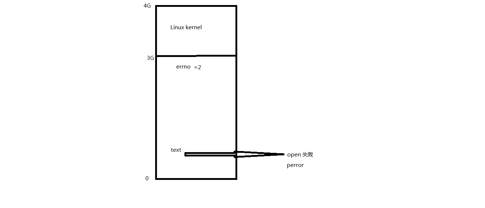

# 15  错误处理机制 #

## errno  ##
<pre>
     #define	EPERM		 1	/* Operation not permitted */ 
     #define	ENOENT		 2	/* No such file or directory */
     #define	ESRCH		 3	/* No such process */
     #define	EINTR		 4	/* Interrupted system call */
     #define	EIO		 5	/* I/O error */
     #define	ENXIO		 6	/* No such device or address */
     #define	E2BIG		 7	/* Argument list too long */
     #define	ENOEXEC		 8	/* Exec format error */
     #define	EBADF		 9	/* Bad file number */
     #define	ECHILD		10	/* No child processes */
     #define	EAGAIN		11	/* Try again */
     #define	ENOMEM		12	/* Out of memory */
     #define	EACCES		13	/* Permission denied */
     #define	EFAULT		14	/* Bad address */
     #define	ENOTBLK		15	/* Block device required */
     #define	EBUSY		16	/* Device or resource busy */
     #define	EEXIST		17	/* File exists */
     #define	EXDEV		18	/* Cross-device link */
     #define	ENODEV		19	/* No such device */
     #define	ENOTDIR		20	/* Not a directory */
     #define	EISDIR		21	/* Is a directory */
     #define	EINVAL		22	/* Invalid argument */
     #define	ENFILE		23	/* File table overflow */
     #define	EMFILE		24	/* Too many open files */
     #define	ENOTTY		25	/* Not a typewriter */
     #define	ETXTBSY		26	/* Text file busy */
     #define	EFBIG		27	/* File too large */
     #define	ENOSPC		28	/* No space left on device */
     #define	ESPIPE		29	/* Illegal seek */
     #define	EROFS		30	/* Read-only file system */
     #define	EMLINK		31	/* Too many links */
     #define	EPIPE		32	/* Broken pipe */
     #define	EDOM		33	/* Math argument out of domain of func */
     #define	ERANGE		34	/* Math result not representable */

## perror ##

     #include <stdio.h>
     void perror(const char *s);
     #include <errno.h>
     const char *sys_errlist[];
     int sys_nerr;
     int errno;

## strerror

     #include <string.h>
     
     char **strerror(int errnum);
     
     int strerror_r(int errnum, char *buf, size_t buflen);
     /* XSI-compliant */
     char *strerror_r(int errnum, char *buf, size_t buflen);
     /* GNU-specific */
