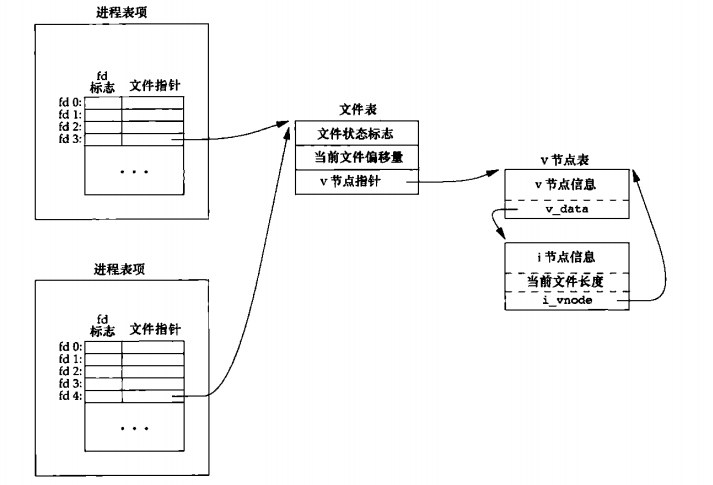

# 16 高级进程间通信

## 16.1 引言

前面讨论了UNIX系统提供的各种IPC，其中包括管道和套接字。本章介绍一种高级IPC——UNIX域套接字机制，并说明它的应用方法。这种形式的IPC可以在同一计算机系统上运行的两个进程间传送打开的文件描述符。服务进程可以使它们的打开文件描述符与指定的名字相关联，同一系统上运行的客户进程可以使用这些名字与服务器进程汇聚。我们还会了解到操作系统该如何为每一个进程提供独用的IPC通道。

## 16.2 UNIX域套接字

UNIX域套接字用于在同一台计算机上运行的进程间的通信。虽然因特网域套接字可以用于同一目的，但是UNIX域套接字效率更高。UNIX域套接字仅仅复制数据，它们不执行协议处理，不需要添加删除网络报头，无需计算校验和，不要产生顺序号，无需发送确认报文。

UNIX域套接字提供流和数据报两种接口，UNIX域数据报服务是可靠的，既不会丢失报文也不会传递出错。UNIX域套接字像是套接字和管道的混合。可以使用它们面向网络的域套接字接口或者使用socketpair函数创建一对无命名的、相互连接的UNIX套接字。
```c
    #include <sys/types.h>          /* See NOTES */
    #include <sys/socket.h>

    int socketpair(int domain, int type, int protocol, int sv[2]);
    //返回值：若成功，返回0，若出错，返回-1
```

虽然接口足够通用，允许socketpair用于其他域，但一般来说操作系统仅对UNIX域提供支持。

### 命名UNIX域套接字

虽然socketpair函数能创建一对互相连接的套接字，但是每一个套接字都没有名字。这意味着无关进程就不能访问它们。恰如因特网域套接字一样，可以命名UNIX域套接字，并可将其用于告示服务，但是要注意，UNIX域套接字使用的地址格式不同于因特网域套接字。

如果我们试图绑定同一地址时，该文件已经存在，那么bind请求会报错，当关闭套接字时，并不自动删除文件，所以必须确保在应用程序退出时，对该文件执行解除链接操作。

## 16.3 唯一连接

服务器进程可以使用bind、listen和accept函数，为客户进程安排一个唯一UNIX域连接。客户进程使用connect与服务器进程联系。在服务器进程接受了connect请求后，在服务器进程和客户进程之间就存在了唯一连接。

## 16.4 传送文件描述符

在两个进程之间传送打开的文件描述符的技术是非常有用的。因此可以对客户进程-服务器进程应用进行不同的设计。它使一个进程（通常是服务器进程）能够处理打开一个文件所要做的一切操作（包括将网络名翻译成网络地址、拨号调制解调器、协商文件锁）以及向调用进程送回一个描述符，该描述符可以被用于以后的所有I/O函数。设计打开文件或设备的所有细节对客户进程都是透明的。

<div align=center>



从顶部进程传送一个打开文件至底部进程
</div>

在技术上，我们是将指向一个打开文件表项的指针从一个进程发送到另一个进程。该指针被分配存放在接收进程的第一个可用描述符项中。（注意，不要造成错觉，以为发送进程和接收进程中描述符编号都是一致的，他们通常不相同。）两个进程贡献跟同一个打开文件表，这与fork之后的父进程和子进程共吸纳过打开文件表的情况完全相同。

当返送进程将描述符传送给接收进程后，通常会关闭该描述符。发送进程关闭该描述符并不会真的关闭该文件设备，其原因是该描述符仍被视为由接收进程打开（即使接受金城尚未接收到该描述符）。

