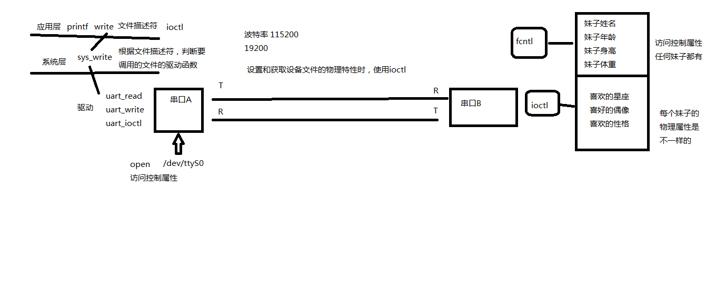

# 1 文件I/O

## 1.1 C标准函数与系统函数的区别

### 1.1.1 函数sysconf、pathconf和fpathconf

函数原型

	#include <unistd.h>
	
	long sysconf(int name);
	long pathconf(const char* pathname, int name);
	long fpathconf(int fd, int name);


后面连个函数的区别在于：一个用路径名作为参数，一个用文件描述符作为参数。

如果name不是一个合适的常量，三个函数都会返回-1，并把errno设置为EINVAL。

有些name会返回一个变量值（返回值≥0）或者提示该值是不确定的。不确定的值通过-1来体现，但是不修改errno的值。

### 1.1.2  I/O缓冲区

每一个FILE文件流都有一个缓冲区buffer，默认大小8192Byte。

### 1.1.3  效率

### 1.1.4  程序的跨平台性

事实上Unbuffered I/O这个名词是有些误导的，虽然write系统调用位于C标准库I/O缓冲区的底层，但在write的底层也可以分配一个内核I/O缓冲区，所以write也不一定是直接写到文件的，也可能写到内核I/O缓冲区中，至于究竟写到了文件中还是内核缓冲区中对于进程来说是没有差别的，如果进程A和进程B打开同一文件，进程A写到内核I/O缓冲区中的数据从进程B也能读到，而C标准库的I/O缓冲区则不具有这一特性（想一想为什么）。

## 1.2 PCB概念——进程控制块

### 1.2.1 task_struct结构

定义位置：/usr/src/linux-headers/include/linux/sched.h

	struct task_struct {
	volatile long state	state;
	void				stack;
	atomic_t			usage;
	unsigned long		flags;
	unsigned long		ptrace;
	int					lock_depth;

Linux提供资源限制机制，该机制使用了task_struct里面的rlim数组，而该数组类型为struct rlimit

	<resource.h>
	struct rlimit {
		unsigned long	rlim_cur;
		unsigned long	rlim_max;
	}

### 1.2.2 files_struct结构体

相当于一张表，或者指针，文件描述符表

	FILE *		fopen("abc")

## 1.3 函數open、create和close

| FLAG       | 作用                                               |
| ---------- | -------------------------------------------------- |
| O_CREAT    | 创建文件                                           |
| O_EXCL     | 创建文件时，如果文件存在则出错返回                 |
| O_TRUNC    | 把文件截断为0                                      |
| O_RDONLY   | 只读（互斥）                                       |
| O_WRONLY   | 只写（互斥）                                       |
| O_RDWR     | 读写（互斥）                                       |
| O_APPEND   | 追加，移动文件读写指针到文件末尾                   |
| O_NONBLOCK | 非阻塞标志                                         |
| O_SYNC     | 每次write都等到物理I/O操作完成，包括文件属性的更新 |

### 1.3.1 文件描述符

对于内核而言，所有打开的文件都是通过文件描述符来引用。当读写文件时，使用open或者creat返回文件描述符来识别该文件，将其作为参数传送给read或write。一个进程默认打开3个文件描述符，并定义在<unistd.h>中。

	STDIN_FILENO 0
	STDOUT_FILENO 1
	STDERR_FILENO 2

open函数可以打开或者创建一个文件，使用open函数，需要包含以下三个头文件

	#include <sys/types.h>
	#include <sys/stat.h>
	#include <fcntl.h>

	int open(const char *path, int oflag,.../*mdoe_t mode*/);
	int openat(int fd, const char* path, int oflag, .../*mdoe_t mode*/);
        //若成功，返回文件描述符，若失败，返回-1

最后的可变参数可以是0个或1个,由flags参数中的标志位决定,见下面的详细说明。

pathname参数是要打开或创建的文件名,和fopen一样,pathname既可以是相对路径也可以是绝对路径。flags参数有一系列常数值可供选择,可以同时选择多个常数用按位或运算符连接起来,所以这些常数的宏定义都以O_开头,表示or。

必选项:以下三个常数中必须指定一个,且仅允许指定一个。

* O_RDONLY 只读打开
* O_WRONLY 只写打开
* O_RDWR 可读可写打开

以下可选项可以同时指定0个或多个,和必选项按位或起来作为flags参数。可选项有很多,这里只介绍一部分,其它选项可参考open(2)的Man Page:
* O_APPEND 表示追加。如果文件已有内容,这次打开文件所写的数据附加到文件的末尾而不覆盖原来的内容。
* O_CREAT 若此文件不存在则创建它。使用此选项时需要提供第三个参数mode,表示该文件的访问权限。
* O_EXCL 如果同时指定了O_CREAT,并且文件已存在,则出错返回。
* O_TRUNC 如果文件已存在,并且以只写或可读可写方式打开,则将其长度截断(Trun-cate)为0字节。
* O_NONBLOCK 对于设备文件,以O_NONBLOCK方式打开可以做非阻塞I/O(Nonblock I/O),非阻塞I/O在下一节详细讲解。

open函数和C标准I/O库的fopen函数细微区别在于：

以可写方式fopen一个文件时，如果文件不存在则会自动创建，而open一个文件时必须使用O_CREAT才会创建文件，否则文件不存在就出错返回。

以w或者w+方式fopen一个文件时，如果文件存在就截断为0字节，而open一个文件必须明确指定O_TRUNC才会截断文件，否则在原来的数据上改写。

以三个参数mode指定文件权限，可以用八进制数表示，比如0644表示-rw-r--r--,也可以用S_IRUSR、S_IWUSR等宏定义按位或起来表示。要注意的是，文件权限由open的mode参数和当前进程的umask共同决定。

函数creat

也可以调用`creat`创建一个新文件
```c
	#include <fcntl.h>

	int creat(const char *path, mode_t mode);
		//此函数等效于open(path, O_WRONLY| O_RDONLY| O_TRUNC, mode)
```

函数close

最大文件打开个数
默认一个进程最多可以打开1024个文件，可以使用

	cat /proc/sys/fs/file-max

通过ulimit -a可以查看和修改文件打开个数

	ulimit -n 4096

## 1.4 read/write

```c
	#include <unistd.h>
	ssize_t read(int fd, void *buf, size_t count);
```

返回值：成功返回读取的**字节数**，出错则返回**-1并设置errno**，如果在调用read之前已经到达文件末尾，则这次read返回**0**；

**ssize_t 有符号int，size_t 无符号int**

参数count是请求读取的字节数,读上来的数据保存在缓冲区buf中,同时文件的当前读写位置向后移。注意这个读写位置和使用C标准I/O库时的读写位置有可能不同,这个读写位置是记在内核中的,而使用C标准I/O库时的读写位置是用户空间I/O缓冲区中的位置。比如用fgetc读一个字节,fgetc有可能从内核中预读1024个字节到I/O缓冲区中,再返回第一个字节,这时该文件在内核中记录的读写位置是1024,而在FILE结构体中记录的读写位置是1。注意返回值类型是ssize_t,表示有符号的size_t,这样既可以返回正的字节数、0(表示到达文件末尾)也可以返回负值-1(表示出错)。read函数返回时,返回值说明了buf中前多少个字节是刚读上来的。有些情况下,实际读到的字节数(返回值)会小于请求读的字节数count,例如:

读常规文件时,在读到count个字节之前已到达文件末尾。例如,距文件末尾还有30个字节而请求读100个字节,则read返回30,下次read将返回0。
从终端设备读,通常以行为单位,读到换行符就返回了。
从网络读,根据不同的传输层协议和内核缓存机制,返回值可能小于请求的字节数,后面socket编程部分会详细讲解。

write函数向打开的设备或文件中写数据。
```c
	#include <unistd.h>

	ssize_t write(int fd, <const> void *buf, size_t count);
	//返回值：成功返回写入的字节数，出错返回-1并设置errno
```

write出错的一个常见原因是磁盘已写满，或者超过了一个给定进程的文件长度限制。写常规文件时,write的返回值通常等于请求写的字节数count,而向终端设备或网络写则不一定。

当多个进程共享文件时，可使用pread/pwrite来原子性的定位并执行I/O。
```c
        #include <unistd.h>

        ssize_t pread(int fd, void *buf, size_t nbytes, off_t offset);
        ssize_t pwrite(int fd, void *buf, size_t nbytes, off_t offset);
```

## 1.5 阻塞和非阻塞

读常规文件是不会阻塞的，不管读多少字节，read都会在有限时间内返回。从终端设备和网络读则不一定，如果从终端输入的数据没有换行符，调用read读终端的设备就会阻塞，如果网络上没有接收到数据包，调用read从网络读就会阻塞，至于阻塞多长时间是不确定的，如果一直没有数据到达就一直阻塞在哪里。同样，写常规文件也是不会阻塞的，而向终端设备或网络写则不一定。

现在明确一下阻塞(Block)这个概念。当进程调用一个阻塞的系统函数时,该进程被置于睡眠(Sleep)状态,这时内核调度其它进程运行,直到该进程等待的事件发生了(比如网络上接收到数据包,或者调用sleep指定的睡眠时间到了)它才有可能继续运行。与睡眠状态相对的是运行(Running)状态,在Linux内核中,处于运行状态的进程分为两种情况:

正在被调度执行。CPU处于该进程的上下文环境中,程序计数器(eip)里保存着该进程的指令地址,通用寄存器里保存着该进程运算过程的中间结果,正在执行该进程的指令,正在读写该进程的地址空间。

就绪状态。该进程不需要等待什么事件发生,随时都可以执行,但CPU暂时还在执行另一个进程,所以该进程在一个就绪队列中等待被内核调度。系统中可能同时有多个就绪的进程,那么该调度谁执行呢?内核的调度算法是基于优先级和时间片的,而且会根据每个进程的运行情况动态调整它的优先级和时间片,让每个进程都能比较公平地得到机会执行,同时要兼顾用户体验,不能让和用户交互的进程响应太慢。

下面这个小程序从终端读数据再写回终端。

### 1.5.1 阻塞读终端

```c
	#include <unistd.h>
	#include <stdlib.h>
	int main(void)
	{
	char buf[10];
	int n;
	n = read(STDIN_FILENO, buf, 10);
	if (n < 0) {
	   perror("read STDIN_FILENO");
	   exit(1);
	}
	write(STDOUT_FILENO, buf, n);
	return 0;
	}
```

### 1.5.2  非阻塞读终端
	轮寻模式

### 1.5.3  非阻塞读终端和等待超时

## 1.6  lseek

类似于标准I/O库的`fseek`函数类似，可以移动当前读写位置，但有一个例外，如果文件以`O_APEND`模式打开，每次写操作都会在文件末尾追加数据，然后讲读写位置移动到新的文件末尾。
`fseek`函数在底层调用`lseek`实现。

### lseek
```c
        #include <sys/types.h>
        #include <unistd.h>
        
        off_t lseek(int fd, off_t offset, int whence);
```         

对参数offset的解释与参数whence有关。

* 若whence是SEEK_SET，则该文件便宜量设置为距文件开始offset个字节

* 若whence是SEEK_CUR，则该文件的偏移量设置为当前值加offset，offset可以为正或者负

* 若whence是SEEK_END，则该文件的偏移量设置为文件长度加上offset，offset可正可负

若`lseek`成功执行，则返回新文件的偏移量，为此可以用下列方式确定打开文件当前的偏移量：

		off_t	currpos;
		currpos = lseek(fd, 0, SEEK_CUR);

额外功能：

1、拓展一个文件，一定要有一次写操作

2、同时可以获取文件大小

### fseek函数
```c
	#include <stdio.h>
	
	int fseek(FILE *stream, long offset, int whence);
	
	long ftell(FILE *stream);
	
	void rewind(FILE *stream);
	
	int fgetpos(FILE *stream, fpos_t *pos);
	int fsetpos(FILE *stream, const fpos_t *pos);
```
# 1.7 fcntl

获取和设置文件访问属性
```c
	#include <unistd.h>
	#include <fcntl.h>
	
	int fcntl(int fd, int cmd, ... /* arg */ );
	int fcntl(int fd, int cmd);
	int fcntl(int fd, int cmd, long arg);
	int fcntl(int fd, int cmd, struct flock *lock);
```
第三个参数常为整数，但是在说明记录锁时， 可以为指向一个结构的指针。

| 参数        | 作用                 |
| :---------: | :------------------: |
| __F_DUPFD__ | 复制一个文件描述符   |
| __F_GETFL__ | 获得一个文件标志状态 |
| __F_SETFL__ | 设置文件状态标志     |
| __F_GETOWN__ | 获取异步I/O所有权  |
| __F_SETOWN__ | 设置异步I/O所有权  |
| __F_GETLK__ | 获取记录锁  |
| __F_SETLK__ 或 __F_SETLKW__ | 设置记录锁  |

## 1.8 函数dup和dup2

下面两个函数都可以用来复制一个文件描述符。
```c
        #include <unistd.h>

        int dup(int fd);
        int dup2(int fd, int fd2);
```
由`dup`返回的新文件描述符一定是当前可用的最小的文件描述符。对于`dup2`，可以用fd2参数制定新的文件描述符。新的文件描述符在执行时关闭（close-on-exec）标志总是有`dup`函数清除。复制一个文件描述符的另一种方式是使用`fcntl`函数。实际上，调用

        dup(fd);

等效于

        fcntl(fd, F_DUPFD, 0);

而调用

        dup2(fd, fd2);

等效于

        close(fd2);
        fcntl(fd, F_DUPFD, fd2);    
        
* 这种情况不完全等价，可能`close`和`fcntl`之间调用了信号捕捉函数，它可能修改文件描述符，不同的线程修改文件描述符的话也会出现相同的问题

* `dup2`和`fcntl`有一些不同的`errno`

函数sync、fsync和fdatasync

传统的UNIX系统是现在内核中设有缓冲区高速缓存或页高速缓存，大多数磁盘I/O斗殴谈过缓冲区进行。当我们写入数据时，内核通常先将数据复制到缓冲区内，然后排入队列，晚些时候在写入磁盘。这种方式被称作延迟写（delayed write）。当内核需要重用缓冲区来存放其他磁盘块数据时，他会把所有的延迟写数据写入磁盘。为了保证实际文件系统与缓冲区中内容的一致性，UNIX提供了`sync`、`fsync`和`fdatasync`三个函数。

```c
        #include <unistd.h>

        int fsync(int fd);
        int fdatasync(int fd);

        void sync(void);    
```

一个称为update的守护进程周期性调用`sync`函数，保证了定期冲洗（flush）内核块缓冲区。

`fsync`函数只对由文件描述符fd指定的一个文件起作用，并且等待写磁盘操作结束时才返回。

`fdatasync`函数类似于`fsync`，但是它只影响文件的数据部分。而除了数据外，`fsync`还会同步更新文件的属性。

## 1.9 函数ioctl

`ioctl`用于向设备发控制和配置命令，有些命令也需要读写一些数据，但是这些数据是不能用read/write读写的，称为Out-of-Band数据。也就是说，read/write读写数据是in-band数据，是I/O操作的主体。而`ioctl`命令传送的是控制信息，其中的数据是辅助的数据。例如，在串口线上收发数据通过read/write操作，而串口的波特率、校验位、停止位通过`ioctl`设置，A/D转换的结果通过`read`读取，而A/D转换的精度和工作频率通过`ioctl`设置。

<center>



ioctl 工作模式</center>

```c
	#inlcude <sys/ioctl.h>
	#include <termios.h> //终端I/O的ioctl操作需要该头文件。
	int ioctl(int fd, int request, ...);
```

fd是某个设备文件描述符。request是ioctl命令，可变参数取决于request。

注意:
* open命令创建文件呢权限不能超过执行用户的自有权限
* 如果有O_CREAT参数时，不要忘记mode参数。


# 2  文件系统

## 2.1  ext2文件系统

| 1024       | ext2管理单元 |
| ---------- | ------------ |
| boot block | 以4k为单元元 |

1block = 4096Bytes
1block = 8磁盘扇区
1磁盘扇区 = 512Bytes
1block = 32768bit

磁盘格式化指令mkfs命令

文件系统中存储的最小单位是块(Block),一个块究竟多大是在格式化时确定的,例如mke2fs的-b选项可以设定块大小为1024、2048或4096字节。而上图中启动块(BootBlock)的大小是确定的,就是1KB,启动块是由PC标准规定的,用来存储磁盘分区信息和启动信息,任何文件系统都不能使用启动块。启动块之后才是ext2文件系统的开始,ext2文件系统将整个分区划成若干个同样大小的块组(Block Group),每个块组都由以下部分组成。

超级块(Super Block) 描述整个分区的文件系统信息,例如块大小、文件系统版本号、上次mount的时间等等。超级块在每个块组的开头都有一份拷贝。

块组描述符表(GDT,Group Descriptor Table) 由很多块组描述符组成,整个分区分成多少个块组就对应有多少个块组描述符。每个块组描述符(Group Descriptor)存储一个块组的描述信息,例如在这个块组中从哪里开始是inode表,从哪里开始是数据块,空闲的inode和数据块还有多少个等等。和超级块类似,块组描述符表在每个块组的开头也都有一份拷贝,这些信息是非常重要的,一旦超级块意外损坏就会丢失整个分区的数据,一旦块组描述符意外损坏就会丢失整个块组的数据,因此它们都有多份拷贝。通常内核只用到第0个块组中的拷贝,当执行e2fsck检查文件系统一致性时,第0个块组中的超级块和块组描述符表就会拷贝到其它块组,这样当第0个块组的开头意外损坏时就可以用其它拷贝来恢复,从而减少损失。

块位图(Block Bitmap) 一个块组中的块是这样利用的:数据块存储所有文件的数据,比如某个分区的块大小是1024字节,某个文件是2049字节,那么就需要三个数据块来存,即使第三个块只存了一个字节也需要占用一个整块;超级块、块组描述符表、块位图、inode位图、inode表这几部分存储该块组的描述信息。那么如何知道哪些块已经用来存储文件数据或其它描述信息,哪些块仍然空闲可用呢?块位图就是用来描述整个块组中哪些块已用哪些块空闲的,它本身占一个块,其中的每个bit代表本块组中的一个块,这个bit为1表示该块已用,这个bit为0表示该块空闲可用。

为什么用df命令统计整个磁盘的已用空间非常快呢?因为只需要查看每个块组的块位图即可,而不需要搜遍整个分区。相反,用du命令查看一个较大目录的已用空间就非常慢,因为不可避免地要搜遍整个目录的所有文件。
与此相联系的另一个问题是:在格式化一个分区时究竟会划出多少个块组呢?主要的限制在于块位图本身必须只占一个块。用mke2fs格式化时默认块大小是1024字节,可以用-b参数指定块大小,现在设块大小指定为b字节,那么一个块可以有8b个bit,这样大小的一个块
位图就可以表示8b个块的占用情况,因此一个块组最多可以有8b个块,如果整个分区有s个块,那么就可以有s/(8b)个块组。格式化时可以用-g参数指定一个块组有多少个块,但是通常不需要手动指定,mke2fs工具会计算出最优的数值。

inode位图(inode Bitmap) 和块位图类似,本身占一个块,其中每个bit表示一个inode是否空闲可用。

inode表(inode Table) 我们知道,一个文件除了数据需要存储之外,一些描述信息也需要存储,例如文件类型(常规、目录、符号链接等),权限,文件大小,创建/修改/访问时间等,也就是ls -l命令看到的那些信息,这些信息存在inode中而不是数据块中。每个文件都有一个inode,一个块组中的所有inode组成了inode表。

inode表占多少个块在格式化时就要决定并写入块组描述符中,mke2fs格式化工具的默认策略是一个块组有多少个8KB就分配多少个inode。由于数据块占了整个块组的绝大部分,也可以近似认为数据块有多少个8KB就分配多少个inode,换句话说,如果平均每个文件的大小是8KB,当分区存满的时候inode表会得到比较充分的利用,数据块也不浪费。如果这个分区存的都是很大的文件(比如电影),则数据块用完的时候inode会有一些浪费,如果这个分区存的都是很小的文件(比如源代码),则有可能数据块还没用完inode就已经用完了,
数据块可能有很大的浪费。如果用户在格式化时能够对这个分区以后要存储的文件大小做一个预测,也可以用mke2fs的-i参数手动指定每多少个字节分配一个inode。__一个inode单元128B，保存文件的访问信息，所属用户和群组信息。__

数据块(Data Block) 根据不同的文件类型有以下几种情况对于常规文件,文件的数据存储在数据块中。

对于目录,该目录下的所有文件名和目录名存储在数据块中,注意文件名保存在它所在目录的数据块中,除文件名之外,ls -l命令看到的其它信息都保存在该文件的inode中。注意这个概念:目录也是一种文件,是一种特殊类型的文件。

对于符号链接,如果目标路径名较短则直接保存在inode中以便更快地查找,如果目标路径名较长则分配一个数据块来保存。

设备文件、FIFO和socket等特殊文件没有数据块,设备文件的主设备号和次设备号保存在inode中。

### 2.1.1  目录中纪录项文件类型

| 编码   | 文件类型         |宏(stat->st_mode)|
| ------ | ---------------- |----------|
| 0      | Unknown          ||
| 1      | Regular file     |S_ISREG()|
| 2      | Directory        |S_ISDIR()|
| 3      | Character device |S_ISCHR()|
| 4      | Block device     |S_ISBLK()|
| 5      | Named pipe       |S_ISFIFO()|
| 6      | Socket           |S_ISSOCK()|
| 7      | Symbolic link    |S_ISLNK()|

### 2.1.2  数据块寻址

从上图可以看出,索引项Blocks[13]指向两级的间接寻址块,最多可表示(b/4)2+b/4+12个数据块,对于1K的块大小最大可表示64.26MB的文件。索引项Blocks[14]指向三级的间接寻址块,最多可表示(b/4)3+(b/4)2+b/4+12个数据块,对于1K的块大小最大可表示16.06GB的文件。

可见,这种寻址方式对于访问不超过12个数据块的小文件是非常快的,访问文件中的任意数据只需要两次读盘操作,一次读inode(也就是读索引项)一次读数据块。而访问大文件中的数据则需要最多五次读盘操作:inode、一级间接寻址块、二级间接寻址块、三级间接寻址块、数据块。实际上,磁盘中的inode和数据块往往已经被内核缓存了,读大文件的效率也不会太低。

## 2.2 函数stat、lstat和fstatat

```c
    #include <sys/types.h>
    #include <sys/stat.h>
    #include <unistd.h>

    int stat(const char *path, struct stat *buf);
    int fstat(int fd, struct stat *buf);
    int lstat(const char *path, struct stat *buf);
    int fstatat(int fd, const char *restrict pathname, struct stat *restrict buf, int flag);

    struct stat {
        dev_t st_dev; /* ID of device containing file */
        ino_t st_ino; /* inode number */
        mode_t st_mode; /* protection */
        nlink_t st_nlink; /* number of hard links */
        uid_t st_uid; /* user ID of owner */
        gid_t st_gid; /* group ID of owner */
        dev_t st_rdev; /* device ID (if special file) */
        off_t st_size; /* total size, in bytes */
        blksize_t st_blksize; /* blocksize for file system I/O */
        blkcnt_t st_blocks; /* number of 512B blocks allocated */
        time_t st_atime; /* time of last access */
        time_t st_mtime; /* time of last modification */
        time_t st_ctime; /* time of last status change */
    };
```

一旦给出pathname，stat函数返回与此命名文件相关的信息结构。

stat既有命令，也有同名函数，用来获取文件Inode里面的主要信息，fstat函数获得已在描述符fd上打开文件的相关信息，stat跟踪符号链接，返回链接符号引用文件的信息，lstat与stat类似，但是当命名文件是个连接时，返回链接相关信息，不跟踪符号链接。

timespec结构体按照秒和纳秒定义了时间，至少包括以下两个字段：
```c
        time_t  tv_sec;
        long    tv_nsec;
```
stat里面时间辨析：
    atime(最近访问时间): mtime(最近更改时间):指最近修改文件内容的时间 ctime(最近改动时间):指最近改动Inode的时间

    Inode修改操作包括更改文件的访问权限、更改用户ID，更改链接数等，它们并不直接修改文件内容。

文件访问和目录权限

|st_mode屏蔽字|含义|
|------------|----|
|S_IRUSR|用户读|
|S_IWUSR|用户写|
|S_IXUSR|用户执行|
|S_IRGRP|组读|
|S_IWGRP|组写|
|S_IXGRP|组执行|
|S_IROTH|其他读|
|S_IWOTH|其他写|
|S_IXOTH|其他执行|

##  2.3 函数access

`access`和faccessat函数是按实际用户ID和实际用户组ID进行访问权限测试。
```C
     #include <unistd.h>

     int access(const char *pathname, int mode);
     int faccessat(int fd, const char *pathname, int mode, int flag);
```

按用户ID和实际组ID测试，跟踪符号链接，如果测试目标文件是否存在，mode就为F_OK，否则mode是与下表所列常量做或运算。参数mode：

 |       |          |
 | ----- | -------------------- |
 | R_OK  | 是否具有读权限       |
 | W_OK  | 是否具有写权限       |
 | X_OK  | 是否具有执行权限     |
 | F_OK  | 测试一个文件是否存在 |

faccessat函数与access函数在下列两种情况下是相同的：一种是pathname参数为绝对路径，另一种是fd参数取值为AT_FDCWD而pathname是相对路径。否则，faccessat计算相对于打开目录得pathname。

flag参数可以用于改变faccessat的行为，如果设置为AT——EACCESS，访问检查是调用进程的有效用户ID和有效组ID，而不是实际用户ID和实际组ID。

## 2.4 函数umask

umask函数为进程设置文件模式创建屏蔽字，并返回之前的值。（这是少数几个没有出错返回函数中的一个。）

```c
        #include <sys/stat.h>

        mode_t umask(mode_t cmask);
```

其中cmask参数是由上述9个参数中的若干位按照“或”运算得来。

## 2.5 函数chmod、fchmod和fchmodat

chmod、fchmod和fchmodat这3个函数可以使我们改变现有文件的访问权限。

```c
        #include <sys/stat.h>

        int chmod(const char *pathname, mode_t mode);
        int fchmod(int fd, mode_t mode);
        int fchmodat(int fd, const char *pathname, mode_t mode, int flag);
```
chmod函数在指定的文件件上执行，fchmod则对一打开的文件进行操作，fchmodat函数与chmod函数在以下两种情况下一致：一种是pathname参数为绝对路径，另一种是fd参数取值为AT_FDCWD而pathname是相对路径。否则，fchmodat计算相对于打开目录（由fd参数指定）的pathname。flag参数可以改变fchmodat的行为，当设置为AT_SYMLINK_NOFOLLOW标志时，不会跟踪符号链接。

##  2.6 函数chown、fchown、fchownat和lchown

下面几个chown函数可以改变文件的用户ID和组ID。如果两个参数woner或group中的任意一个是-1，则对应的ID不变。

```c
        #include <unistd.h>

        int chown(const char *pathname, uid_t owner, gid_t group);
        int fchown(int fd, uid_t owner, gid_t group);
        int fchownat(int fd, const char *pathname, uid_t owner, gid_t group, int flag);
        int lchown(const char *pathname, uid_t owner, gid_t group);
        //四个函数的返回值：若成功，返回0， 若失败，返回-1
```

除了引用的文件是符号链接外，这4个函数操作类似。在符号链接情况下，lchown和fchownat（设置了AT_SYMLINK_NOFOLLOW标志）更改符号链接本身的所有者，而不是符号链接指向文件的所有者。

fchown改变fd参数指向的打开文件的所有者，既然它在一个已打开的文件上操作，就不能用于改变符号链接的所有者。

fchownat在以下两种情况下是相同的：一种是pathname参数为绝对路径，另一种是fd参数取值为AT_FDCWD而pathname是相对路径。这两种情况下，如果flag参数中设置了AT_SYMLINK_NOFOLLOW标志，fchownat与lchown行为相同。如果fd参数设置为打开目录得文件描述符，并且pathname参数是一个相对路径名，fchownat函数计算相对于打开目录得pathname。

## 2.7 文件截断

优势我们需要在文件尾端处截去一些数据缩短文件。讲一个文件长度截断为0是一个特例，在打开文件的时候用O_TRUNC标志可以做到这一点。为了截断文件可以调用函数`truncate`和`ftruncate`。

```c
        #include <unistd.h>

        int truncate(const char *pathname, off_t length);
        int ftruncate(int fd, off_t length);
```

这两个函数将一个现有文件的长度截位断为length，如果该文件长度大于length，则超过length以外的数据就不再能访问。如果以前的长度小于length，则文件长度增加，在以前文件的尾端到新文件尾端之间数据将读作0。

## 2.8 函数link、linkat、unlink、unlinkat和remove

```c
        #include <unistd.h>

        int link(const char * existingpath, const char *newpath);
        int linkat(int efd, const char *existingpath, int nfd, const char *newpath, int flag);
```
两个函数创建新目录项`newpath`，它引用现有文件`existingpath`。如果`newpath`已经存在，则返回出错。只创建`newpath`中的最后一个分量，路径中其他部分应该存在。

### link

创建一个硬链接，当`rm`删除文件时，只是删除了目录下记录项和把inode硬链接计数减1，当硬链接计数为0时，才会真正删除文件。<br>
    __硬链接通常要求位于同意文件系统中，POSIX允许跨文件系统__<br>
    __符号链接没有文件系统限制__<br>
    __通常不允许创建目录的硬链接__,会出现死循环<br>
    __创建目录以及增加硬链接计数应当是一个原子操作__<br>

删除一个现有的目录项，可以调用`unlink`函数

```c
        #include <unistd.h>

        int unlink(const char *pathname);
        int unlinkat(int fd, const char *pathname, int flag);
```
这两个函数删除目录项，并将由`pathname`所引用的文件链接技术减1。当计数链接达到0时，该文件才可以删除，另一个条件也可以阻止删除文件的内容--只要有进程打开了该文件，其内容也不能删除。关闭一个文件时，内核首先检查打开该文件进程的个数，如果这个计数达到0，内核会继续检查其链接计数，如果计数也是0，那么久删除文件内容。`unlink`的这一特性常被程序用来确保即使在程序崩溃时，它所创建的文件也不会遗留下来。

### unlink

```c
        #include <unistd.h>

        int unlink(const char *pathname);
```

1. 如果是符号链接,删除符号链接
2. 如果是硬链接,硬链接数减1,当减为0时,释放数据块和inode
3. 如果文件硬链接数为0,但有进程已打开该文件,并持有文件描述符,则等该进程关闭该文件时,kernel才真正去删除该文件
4. 利用该特性创建临时文件,先open或creat创建一个文件,马上unlink此文件

我们也可以用`remove`函数来结束对一个文件或者目录的链接，对于文件，`remove`的功能与unlink相同。对于目录，`remove`的功能和`rmdir`相同。

```c
        #include <stdio.h>

        int remove(const char *pathname);
```

## 函数rename和renameat

文件或者目录可以用rename函数或者renameat函数进行重命名。

```c
        #include <stdio.h>

        int rename(const char *oldname, const char *newname);
        int renameat(int oldfd, const char *oldname, int newfd, const char *newname);
```

根据oldname是指文件、目录还是链接，有几种情况需要说明。

1. 如果oldname指的是一个文件而不是目录，那么为该文件或者符号链接重命名。在这种情况下，如果rename已经存在，而且不是一个目录，则先将该目录想删除后将oldname命名成newname。对包含oldname的目录以及包含newname的目录，调用进程必须有写权限，因为将更改这两个目录。


符号链接是对一个文件的间接指针，但是与之前所述的硬链接有所不同，硬链接直接指向文件的i节点。引入符号链接的原因是为了避开硬链接的某些限制。

* 硬链接通常要求链接和文件在同一文件系统中。
* 只有超级用户才能创建指向目录的硬链接。

### 函数symlink和symlinkat

```C
        #include <unistd.h>
        int symlink(const char *actualpath, const char *sympath);
        int symlinkat(const char *actualpath, int fd, const char *sympath);
        //两个函数的返回值，成功返回0；若出错，返回-1
```

函数创建了一个指向actualpath的新目录项sympath。在创建此符号链接时，并不要求actualpath已经存在。并且，actualpath和sympath并不需要在同一文件系统中。

因为open函数跟随符号链接，所以需要有一种方法来打开链接本身，并读取链接中的名字。readlink和readlinkat函数提供这种功能。

### readlink

    读符号链接所指向的文件名，不读文件内容。

```c
        #include <unistd.h>

        ssize_t readlink(const char *restrict pathname, char *restrict buf, size_t bufsiz);
        ssize_t readlinkat(int fd, const char *restrict pathname, char *restrict buf, size_t bufsiz);
        //两个函数的返回值：若成功，返回读取的字节数；若失败，返回-1
```

两个函数组合了open、read和close的所有操作。如果函数成功执行，则返回读入buf的字节数。在buf中返回的符号链接内容不已null字节终止。

## 2.9 函数futimens、utimensat和utimes

一个文件的访问和修改时间可以用以下几个函数更改。futimens和utimensat可以指定纳秒级精度的时间戳。用到的数据结构是与stat函数族相同的timespec结构。

```c
        #include <sys/stat.h>

        int futimens(int fd, const struct timespec times[2]);
        int utimensat(int fd, const char *path, const struct timespec times[2], int flag);
```
times数组第一个元素表示最后访问时间，第二个元素包含修改时间，不足秒的部分用纳秒表示。

```c
        #include <sys/time.h>

        int utimens(const char *path, const struct timeval times[2]);
```

utimes函数对路径名进行操作。times参数指向包含两个时间戳元素的数组指针，两个时间戳都是用秒和微秒表示的。

```c
        strcut tiemval{
            time_t  tv_sec; /*seconds*/
            long`   tv_usec;/*microseconds*/
        }
```
注意我们不能对状态更改时间st_ctim(inode最近被修改的时间)指定一个值，因为在调用utimes的时候，此字段会被自动更新。

## 2.10  目录操作函数mkdir、mkdirat和rmdir

```c
       #include <sys/stat.h>
       #include <sys/types.h>

       int mkdir(const char *pathname, mode_t mode);
       int mkdirat(int fd, const char *pathname, mode_t mode);
       //两个函数返回值：若成功，返回0；若失败，返回-1
```
这两个函数创建一个新目录。其中，`.`和`..`目录项是自动创建的。所制定的文件访问权限mode由进程的文件模式创建屏蔽字修改。常见的错误是指定与文件相同的mode（只指定读、写权限）。但是对于目录通常至少要设置一个执行权限位，以允许访问目录中的文件名。

用rmdir函数可以删除一个空目录。空目录是指只包含`.`和`..`这两项的目录。

```c
       #include <unistd.h>

       int rmdir(const char *pathname);
```

## 2.11  opendir/fdopendir

```c
       #include <sys/types.h>
       #include <dirent.h>

       DIR *opendir(const char *name);
       DIR *fdopendir(int fd);

       struct dirent *readdir(DIR *dirp);//返回一个纪录项指针

       struct dirent {
            ino_t          d_ino;       /* inode number */  //important
            off_t          d_off;       /* not an offset; see NOTES */
            unsigned short d_reclen;    /* length of this record */
            unsigned char  d_type;      /* type of file; not supported
                                        by all filesystem types */
            char           d_name[256]; /* filename */      //important
        };

        void rewinddir(DIR *dp);
        int closedir(DIR *dp);

        long telldir(DIR *dp);
        void seekdir(DIR *dp, long loc);    /*这两个函数并不是基本的POSIX.1标准组成部分*/
```

fdopendir提供一种方法将打开的文件描述符转换为目录处理函数所需要的DIR结构。由opendir和fdopendir返回的DIR结构指针可由其他5个函数调用。

遍历层次结构的函数ftw(file tree walk)

## 2.12 函数chdir、fchdir和getcwd

```c
    #include <unistd.h>

    int chdir(const char *pathname);
    int fchdir(int fd);
```
改变当前进程的工作目录,每个进程都有一个当前工作目录，此目录是搜索所有相对路径的起点。当前工作目录时进程的一个属性，而起始目录是登录名的一个属性。

```c
    #include <unistd.h>

    char *getcwd(char *buf, size_t size);
```
获取当前进程工作目录,它从当前工作目录`.`开始，用`..`找到其上一级目录，然后读其目录项，直到该目录项中的i节点编号与工作目录得i节点编号相同，这样找到了对应的文件名。按照这种方法逐层上移，直到遇到跟，就得到了当前目录的绝对路径。必须向次函数传递两个参数，一个是缓冲区地址buf，另一个是缓冲区长度size（以字节为单位）。缓冲区必须有足够的长度以容纳绝对路径加上一各终止null字节，否则出错。

应当注意，chdir跟随符号链接。

## 2.13  pathconf

```c
    #include <unistd.h>

    long fpathconf(int fd, int name);
    long pathconf(const char *path, int name);
```
