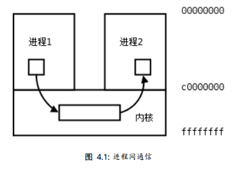

# 4  进程间通信（IPC，Inter-Process Communication）

每个进程各自有不同的用户地址空间，任何一个进程的全局变量在另一个进程中都看不到，所以进程之间要交换数据必须通过内核，在内核中开辟一块缓冲区，进程1把数据从用户空间拷到内核缓冲区，进程2再从内核缓冲区把数据读走，内核提供的这种机制称为进程间通信（IPC，InterProcess Communication）。

<center>



"图4.1 进程间通信"

</center>

## 4.1  pipe管道

管道是一种最基本的IPC机制，由pipe函数创建：

``` 
        #include <unistd.h>
        int pipe(int filedes[2]);
```

管道作用于有**血缘关系**的进程之间,通过fork来传递调用pipe函数时在内核中开辟一块缓冲区（称为管道）用于通信，它有一个读端一个写端，然后通过filedes参数传出给用户程序两个文件描述符，filedes[0]指向管道的读端，filedes[1]指向管道的写端（很好记，就像0是标准输入1是标准输出一样）。所以管道在用户程序看起来就像一个打开的文件，通过read(filedes[0]);或者write(filedes[1]);向这个文件读写数据其实是在读写内核缓冲区。pipe函数调用成功返回0，调用失败返回-1。
        
开辟了管道之后如何实现两个进程间的通信呢？比如可以按下面的步骤通信。
        
1.父进程调用pipe开辟管道，得到两个文件描述符指向管道的两端。
2.父进程调用fork创建子进程，那么子进程也有两个文件描述符指向同一管道。
3.父进程关闭管道读端，子进程关闭管道写端。父进程可以往管道里写，子进程可以从管道里读，管道是用环形队列实现的，数据从写端流入从读端流出，这样就实现了进程间通信。

__父写子读： 关闭父读，关闭子写__

__子写父读： 关闭子读，关闭父写__

例 pipe管道

```c
    #include <stdlib.h>
    #include <unistd.h>
    #define MAXLINE 80
    int main(void)
    {
        int n;
        int fd[2];
        pid_t pid;
        char line[MAXLINE];
        if (pipe(fd) < 0) {
            perror("pipe");
            exit(1);
        }
        if ((pid = fork()) < 0) {
            perror("fork");
            exit(1);
            }
        if (pid > 0) { /* parent */
            close(fd[0]);
            write(fd[1], "hello world\n", 12);
            wait(NULL);
            } 
        else { /* child */
            close(fd[1]);
            n = read(fd[0], line, MAXLINE);
            write(STDOUT_FILENO, line, n);
        }
        return 0;
    }
```
总结

ls -l | grep "name"     **使用示例**

pipe用于有血缘关系的进程之间，通过fork来传递      **fork(fd[2])**

文件描述符在父子进程之间传递，但相同的文件描述符对应唯一的file结构体（公用读写指针位置）

写端关闭，读端读完管道里的内容时，再次读，返回0，相当于EOF

写端未关闭，写端暂无数据，读端读完管道数据时，再次读，阻塞

读端关闭，写端写管道，产生SIGPIPE信号，写进程默认情况下会终止进程

读端未读管道，写端写满管道后，再次写，阻塞

使用管道有一些限制：

两个进程通过一个管道只能实现单向通信，比如上面的例子，父进程写子进程读，如果有时候也需要子进程写父进程读，就必须另开一个管道。请读者思考，如果只开一个管道，但是父进程不关闭读端，子进程也不关闭写端，双方都有读端和写端，为什么不能实现双向通信？

管道的读写端通过打开的文件描述符来传递，因此要通信的两个进程必须从它们的公共祖先那里继承管道文件描述符。上面的例子是父进程把文件描述符传给子进程之后父子进程之间通信，也可以父进程fork两次，把文件描述符传给两个子进程，然后两个子进程之间通信，总之需要通过fork传递文件描述符使两个进程都能访问同一管道，它们才能通信。

使用管道需要注意以下4种特殊情况（假设都是阻塞I/O操作，没有设置O_NONBLOCK标志）：
1.如果所有指向管道写端的文件描述符都关闭了（管道写端的引用计数等于0），而仍然有进程从管道的读端读数据，那么管道中剩余的数据都被读取后，再次read会返回0，就像读到文件末尾一样。

2.如果有指向管道写端的文件描述符没关闭（管道写端的引用计数大于0），而持有管道写端的进程也没有向管道中写数据，这时有进程从管道读端读数据，那么管道中剩余的数据都被读取后，再次read会阻塞，直到管道中有数据可读了才读取数据并返回。

3.如果所有指向管道读端的文件描述符都关闭了（管道读端的引用计数等于0），这时有进程向管道的写端write，那么该进程会收到信号SIGPIPE，通常会导致进程异常终止。讲信号时会讲到怎样使SIGPIPE信号不终止进程。

4.如果有指向管道读端的文件描述符没关闭（管道读端的引用计数大于0），而持有管道读端的进程也没有从管道中读数据，这时有进程向管道写端写数据，那么在管道被写满时再次write会阻塞，直到管道中有空位置了才写入数据并返回。
管道的这四种特殊情况具有普遍意义。

非阻塞管道, fcntl函数设置O_NONBLOCK标志

fpathconf(int fd, int name)测试管道缓冲区大小，_PC_PIPE_

## 4.2  fifo有名管道

创建一个有名管道，解决无血缘进程之间的通信，fifo：

mkfifo 既有命令也有函数

```c
    #include <sys/types.h>
    #include <sys/stat.h>
    int mkfifo(const char *pathname, mode_t mode);
```

## 4.3  内存共享映射

### 4.3.1  mmap/munmap

mmap可以把磁盘文件的一部分直接映射到内存，这样文件中的位置直接就有对应的内存地址，对文件的读写可以直接用指针来做而不需要read/write函数。

```c
    #include <sys/mman.h>
    void *mmap(void *addr, size_t length, int prot, int flags, int fd, off_t offset);
    int munmap(void *addr, size_t length);
```

如果addr参数为NULL，内核会自己在进程地址空间中选择合适的地址建立映射。如果addr不是NULL，则给内核一个提示，应该从什么地址开始映射，内核会选择addr之上的某个合适的地址开始映射。建立映射后，真正的映射首地址通过返回值可以得到。len参数是需要映射的那一部分文件的长度。off参数是从文件的什么位置开始映射，必须是页大小的整数倍（在32位系统结构上通常是4K）。filedes是代表该文件的描述符。

prot参数有四种取值：

* PROT_EXEC表示映射的这一段可执行，例如映射共享库
* PROT_READ表示映射的这一段可读
* PROT_WRITE表示映射的这一段可写
* PROT_NONE表示映射的这一段不可访问

flag参数有很多种取值，这里只讲两种，其它取值可查看mmap(2)
* MAP_SHARED多个进程对同一个文件的映射是共享的，一个进程对映射的内存做了修改，另一个进程也会看到这种变化。
* MAP_PRIVATE多个进程对同一个文件的映射不是共享的，一个进程对映射的内存做了修改，另一个进程并不会看到这种变化，也不会真的写到文件中去。

如果mmap成功则返回映射首地址，如果出错则返回常数MAP_FAILED。当进程终止时，该进程的映射内存会自动解除，也可以调用munmap解除映射。munmap成功返回0，出错返回-1。

下面做一个简单的实验

使用mmap映射
```c
    #include <stdlib.h>
    #include <sys/mman.h>
    #include <fcntl.h>
    int main(void)
    {
        int *p;
        int fd = open("hello", O_RDWR);
        if (fd < 0) {
            perror("open hello");
        exit(1);
    }
    p = mmap(NULL, 6, PROT_WRITE, MAP_SHARED, fd, 0);
    if (p == MAP_FAILED) {
        perror("mmap");
        exit(1);
    }
    close(fd);
    p[0] = 0x30313233;
    munmap(p, 6);
    return 0;
    }
```

* 用于进程间通信时，一般设计成结构体，来传输通信的数据
* 进程间通信的文件，应该设计成临时文件
* 当报总线错误时，优先查看共享文件是否有存储空间

### 4.3.2  进程间共享通信

写进程实现
```c
    #include <stdio.h>
    #include <stdlib.h>
    #include <fcntl.h>
    #include <sys/stat.h>
    #include <sys/types.h>
    #include <unistd.h>
    #include <sys/mman.h>
    #include <fcntl.h>
    
    #define MAPLEN 0x1000
     
    void sys_err(char* str, int exitno){
    	perror("str");
    	exit(exitno);
    }
    
    int main(int argc, char * argv[]){
    	char *mm;
    	int fd, i = 0;
    	if(argc <2){
    		printf("./mmap_w filename\n");
    		exit(1);
    	}
    	fd = open(argv[1], O_RDWR | O_CREAT, 0777);
    	if(fd < 0){
    		sys_err("open", 1);
    	}
    
    	if(lseek(fd, MAPLEN-1, SEEK_SET)<0)
    		sys_err("lseek", 3);
    	if(write(fd, "\0", 1)<0)
    		sys_err("write", 4);
    
    	mm = mmap(NULL, MAPLEN, PROT_READ | PROT_WRITE,MAP_SHARED, fd, 0);
    	close(fd);
    	if(mm == MAP_FAILED)
    		sys_err("mmap", 2);
    	while(1){
    		sprintf(mm, "hello %d", i++);
    		sleep(1);
    	}
    	munmap(mm, MAPLEN);
    	return 0;
    }
```

读进程实现
```c
    #include <stdio.h>
    #include <stdlib.h>
    #include <fcntl.h>
    #include <sys/stat.h>
    #include <sys/types.h>
    #include <unistd.h>
    #include <sys/mman.h>
    #include <fcntl.h>
    
    #define MAPLEN 0x1000
     
    void sys_err(char* str, int exitno){
    	perror("str");
    	exit(exitno);
    }
    
    int main(int argc, char * argv[]){
    	char *mm;
    	int fd, i = 0;
    	if(argc <2){
    		printf("./mmap_w filename\n");
    		exit(1);
    	}
    	fd = open(argv[1], O_RDWR, 0777);
    	if(fd < 0){
    		sys_err("open", 1);
    	}
    
    	mm = mmap(NULL, MAPLEN, PROT_READ | PROT_WRITE,MAP_SHARED, fd, 0);
    	close(fd);
    	if(mm == MAP_FAILED)
    		sys_err("mmap", 2);
    	while(1){
    		printf("%s\n", mm);
    		sleep(1);
    	}
    	munmap(mm, MAPLEN);
    	return 0;
    }
```

* 用于进程间通信时，一般设计成结构体，用来传输通信数据
* 进程间通信的文件，应该设计成临时文件

**open和mmap的读写权限要匹配**

## 4.4  Unix Domain Socket


