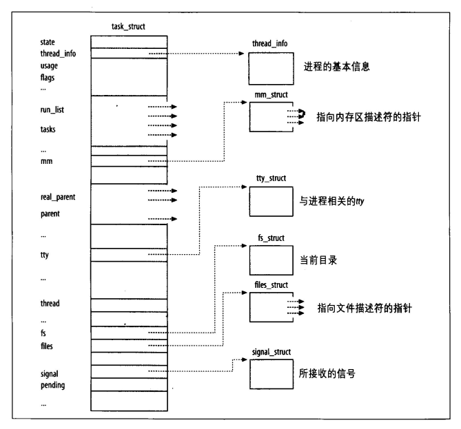

# 4 进程环境

## 引言

**程序和进程**

**程序**

程序是一个储存在磁盘上某个目录中的可执行文件。内核使用exec函数，将程序读入内存执行。

**进程**

程序执行的实例被称之为进程。某些操作系统用任务（task）表示正在被执行的程序。

**线程和线程ID**

通常，一个进程只有一个控制线程——某一时刻执行的一组机器指令。对于某些问题，如过有多个控制线程分别作用于它的不同部分，那么解决起来容易的多。另外多个控制线程也可以充分利用多处理器系统的并行能力。

一个进程内所有的线程共享同一地址空间、文件描述符、栈以及与进程相关的属性。因为它们能访问同一储存区，所以个县城在访问共享数据时需要采取同步措施以避免不一致。

与进程相同，线程也是用ID标识，但是，线程ID只在它所属的进程内起作用，一个进程中的线程ID在另一个进程中没有意义。当在一进程中对某个特定线程进行处理时，我们可以使用该线程的ID引用它。

本节记录进程控制原语，在此之前先了解进程的环境。本章中将学习：当程序执行时，其main函数是如何被调用的；命令行参数是如何传递给新程序的；典型的储存空间布局是什么样式；如何分配另外的储存空间；进程如何使用环境变量；进程的各种终止方式等。另外，还将说明longjmp和setjmp函数以及他们与栈交互作用。

每个进程在内核中都有一个进程控制块(PCB)来维护进程相关的信息，Linux内核进程控制块是task_struct结构体.

<div align=center>



Linux进程描述符
</div>

* 进程id。系统中每个进程有唯一的id,在C语言中用pid_t类型表示,其实就是一个非负整数。
* 进程的状态,有运行、挂起、停止、僵尸等状态。
* 进程切换时需要保存和恢复的一些CPU寄存器。
* 描述虚拟地址空间的信息。
* 描述控制终端的信息。
* 当前工作目录(Current Working Directory)。
* umask掩码。
* 文件描述符表,包含很多指向file结构体的指针。
* 和信号相关的信息。
* 用户id和组id。
* 控制终端、Session和进程组。
* 进程可以使用的资源上限(Resource Limit)。

## 4.1 main函数

C程序总是从main函数开始执行。main函数的原型是：
```c
    int main(int argc, char *argv[]);
```   
其中，`argc`是参数数目，`argv`是指向参数各个指针构成的数组。当内核执行C程序时，在调用`main`前先调用一个特殊的启动例程。可执行程序文件将此启动例程指定为**程序的起始地址**——这是由连接编辑器设置的，而连接编辑器是由C编译器调用。启动例程从内核获取命令行参数和环境变量值，然后为按上述方法调用main函数做好安排。

## 4.2 进程终止

有8种方式使进程终止（termination），其中5中是正常终止，他们是：

1. 从main返回；
2. 调用exit；
4. 调用_exit或_Exit;
4. 最后一个线程从起启动例程返回；
5. 从最后一个线程调用pthread_exit;

异常终止有3种方式，他们是：

6. 调用abort；
7. 接收到一个信号；
5. 最后一个线程对取消请求做出相应。

上面提及的启动例程是这样编写的，使得从main返回后立即调用exit函数。如过将启动例程以C代码形式书写（实际上该例程常常用汇编代码编写），则它调用main函数的形式可能是：
    exit(main(argc, argv));

### 4.2.1 退出函数

3个函数用于正常终止一个程序：_exit和_Exit立即进入内核，exit则先执行一些清除处理，然后返回内核。

```c
    #include <stdlib.h>

    void eixt(int status);
    void _Exit(int status);

    #include <unistd.h>

    void _exit(int status);
```

由于历史原因，exit函数总是执行一个标准I/O库清理关闭操作：对于所有打开流调用fclose函数。这造成输出缓冲中的所有数据被冲洗（写到文件上）。

3个退出函数都带有一个整形参数，称为终止状态（或退出状态）。大多数UNIX系统shell都提供检查进程中止状态的方法。如过（a）调用这些函数时不带终止状态，或（b）main执行了一个无返回值的return语句，或（c）main没有生命返回类型为整数，则该进程的终止状态是 **未定义** 的。但是，若main的返回类型是整形，并且main执行到最后一条语句是返回（隐式返回），那么该进程的终止状态是0。

main函数返回一个整形和该函数调用exit是等价的。于是在main函数中
    exit(0);
等价于
    return(0);

### 4.2.2 函数atexit

按照ISO C的规定，一个进程最多可以登记至多32个函数，这些函数由exit自动调用。我们称这些函数为 **终止处理程序（exit handler）**，并调用函数来登记这些函数。

```c
    #include <stdlib.h>

    int atexit(void (*func)(void));
```

其中，atexit的参数是一个函数地址，当调用此函数时无需向他传递任何参数，也不期望它返回一个值。exit调用这些函数的顺序与它们登记时的顺序相反。同一函数若登记多次，也会被调用多次。

<div align=center>


一个C程序是如何启动和终止的
</div>

注意，内核是程序执行的唯一方法是调用一个exec函数。进程自愿终止的唯一方法是显示或隐式调用_exit或_Exit。进程也可以非自愿地由一个信号使其终止。

## 4.3 命令行参数

当执行一个程序时，调用exec的进程可将命令行参数传递给该新程序。这是UNIX shell的一部分新常规操作。ISO C和POSIX.1都要求argv[argc]是一个空指针，即argv[argc]=NULL。

## 4.4 环境表

每个程序都接收一张环境表。与参数表一样，环境表也是一个字符指针数组，其中每个指针包含一个以null结束的C字符串的地址。全局变量environ则包含了该指针数组的地址：
```c
    extern char **environ;
```
例如，如果该环境包含5个字符串，每个字符串结尾处都有显示地有一个null字节。我们称environ为环境指针，指针数组为环境表，其中个指针指向的字符串为环境字符串。可用getenv和putenv来访问特定的环境变量。
<div align=center>


包含5个环境变量的environ环境表
</div>

## 4.5 C程序的储存空间布局

* 正文段。这是由CPU执行的机器指令部分。属性只读
* 初始化数据段。通常此段称之为数据段，它包含饿了程序中需要明确地赋值的变量。
* 未初始化数据段。通常称之为bss段，在程序开始前，内核将其初始化为0或者空指针。函数以外的普通声明存放在此。
* 栈。自动变量以及每次函数调用时所需保存的信息都存放在此段中。
* 堆。通常堆中进行动态储存分配。

## 4.6 共享库

共享库使得可执行文件中不再需要包含共用的库函数，而只需要在所有进程都可引用的储存区中保存这种库例程的一个副本。程序第一次执行或者第一次调用某个库函数时，用动态链接方法将程序与共享库函数链接。这减少了每个可执行文件的长度，但增加了一些运行时间开销。这种时间开销发生在该程序第一次被执行的时，或者每个共享库第一次被调用时。共享库的另一个优点是可以用库函数的新版本代替老版本而无需对使用该库的程序重新链接编辑（假设参数的数目和类型都没有发生变化）。

## 4.7 储存空间分配

ISO C说明了3个用于储存空间动态分配的函数。

1. malloc，分配指定字节数的储存区。此储存区的初始值不确定。
2. calloc，为只多功能数量指定长度的对象分配储存空间。该空间每一位（bit）都初始化为0.
4. realloc，增加或者减少以前分配区的长度。当增加长度时，可能需要将以前分配的内容移到另一个足够大的区域，以便在尾端提供增加的储存区，而新增区域内的初始值则不确定。

```c
    #include <stdlib.h>

    void *malloc(size_t size);
    void *calloc(size_t mobj, size_t size);
    void *realloc(void *ptr, size_t newsize);

    void free(void *ptr);
```
这三个函数所返回的指针是适当对其的，使其可用于各种对象。这些分配例程通常使用sbrk(2)系统调用实现。该系统调用扩充（或缩小）进程的堆。

**替代的储存空间分配程序**

有很多可以替代malloc和free的函数。某些系统已经提供代替储存空间分配函数的库，另一些系统只提供标准储存空间分配程序。

1. libmalloc
2. vmalloc
4. quick-fit
4. jemalloc
5. TCMalloc
6. alloca

## 4.8 环境变量

环境变量的字符串形式是：
name = value

ISO C定义了一个函数getenv，可以用其取环境变量的值，但是该标准又称环境的内容是由实现定义的。

```c
    #include <stdlib.h>

    char *getenv(const char*name);
```
函数返回一个指针，它指向name=value字符串中的value。我们应当使用getenv从环境变量中取一个指定环境变量的值，而不是访问environ。

除了获取环境变量的值，有时也需要设置环境变量。但是并不是所有的系统都支持这种能力
```c
    #include <stdlib.h>

    int putenv(char *string);   //若成功，返回0；若出错，返回非0
    int setenv(const char *name, const char *value, int overwrite);
    int unsetenv(const char *name);
    //两个函数返回值：若成功，返回0；若出错，返回-1；
```

libc中定义的全局变量environ指向环境变量表，environ没有包含在任何头文件中，所以在使用时要用extern声明。例如：
```c
    #include <stdio.h>
    int main(void)
    {
        extern char **environ;
        int i;
        for(i=0; environ[i]!=NULL; i++)
            printf("%s\n", environ[i]);
        return 0;
    }
```
由于父进程在调用fork创建子进程时会把自己的环境变量表也复制给子进程，所以a.out打印的环境变量和Shell进程的环境变量是相同的。
    
按照惯例，环境变量字符串都是name=value这样的形式，大多数name由大写字母加下划线组成，一般把name的部分叫做环境变量，value的部分则是环境变量的值。环境变量定义了进程的运行环境，一些比较重要的环境变量的含义如下：

PATH

* 可执行文件的搜索路径。ls命令也是一个程序，执行它不需要提供完整的路径名/bin/ls，然而通常我们执行当前目录下的程序a.out却需要提供完整的路径名./a.out，这是因为PATH环境变量的值里面包含了ls命令所在的目录/bin，却不包含a.out所在的目录。PATH环境变量的值可以包含多个目录，用:号隔开。在Shell中用echo命令可以查看这个环境变量的值：

$ echo $PATH

SHELL

* 当前Shell，它的值通常是/bin/bash。

TERM

* 当前终端类型，在图形界面终端下它的值通常是xterm，终端类型决定了一些程序的输出显示方式，比如图形界面终端可以显示汉字，而字符终端一般不行。

LANG

* 语言和locale，决定了字符编码以及时间、货币等信息的显示格式。

HOME
* 当前用户主目录的路径，很多程序需要在主目录下保存配置文件，使得每个用户在运行该程序时都有自己的一套配置。

用environ指针可以查看所有环境变量字符串，但是不够方便，如果给出name要在环境变量表中查找它对应的value，可以用getenv函数。
```c   
    #include <stdlib.h>

    char *getenv(const char *name);
```  
getenv的返回值是指向value的指针，若未找到则为NULL。
修改环境变量可以用以下函数
```c
        #include <stdlib.h>

        int setenv(const char *name, const char *value, int rewrite);
        void unsetenv(const char *name);
```    
putenv和setenv函数若成功则返回为0，若出错则返回非0。

setenv将环境变量name的值设置为value。如果已存在环境变量name，那么
- 若rewrite非0，则覆盖原来的定义；
- 若rewrite为0，则不覆盖原来的定义，也不返回错误。

unsetenv删除name的定义。即使name没有定义也不返回错误。

例 修改环境变量
```c    
    #include <stdlib.h>
    #include <stdio.h>
    int main(void)
    {
        printf("PATH=%s\n", getenv("PATH"));
        setenv("PATH", "hello", 1);
        printf("PATH=%s\n", getenv("PATH"));
        return 0;
    }
```

## 4.9 函数setjmp和longjmp

在C中，goto语句是不能跨越函数的，而执行这种跳转功能的是函数setjmp和longjmp。这两个函数在处理发生在很深层嵌套函数调用中的出错情况是非常有用的。

## 4.10 函数getrlimit和setrlimit

每个进程都有一组资源限制，其中一些可以用getrlimit和setrlimit函数查询和更改。

```c
    #include <sys/resource.h>

    int getrlimit(int resource, struct rlimit *rlptr);
    int setrlimit(int resource, const struct rlimit *rlptr);

    struct rlimit{
        rlim_t  rlim_cur;   /*soft limit: current limit*/
        rlim_t  rlim_max;   /*hard limit: maximum value for rlim_cur*/
    };
```
在更改资源限制时，需遵循下列3条规则。
1. 任何一个进程都可以将一个软限制值更改为小于或等于其硬限制值。
2. 任何一个进程都可以降低硬限制值，但它必须大于或等于软限制值。这种降低对普通用户是不可逆的。
4. 只有超级用户进程可以提高硬限制值。

查看进程资源限制
```sh
    cat /proc/self/limits
    ulimit -a
```       