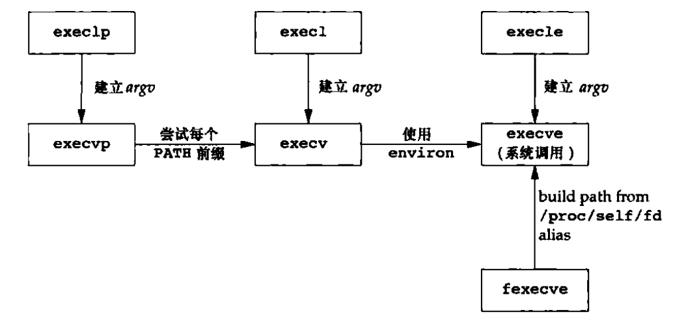

# 5 进程控制

## 5.1 引言
本节介绍UNIX系统控制机制，包括创建新进程、执行程序和进程终止。还将说明进程属性的各种ID——实际、有效和保存的用户ID和组ID，以及它们如何收到进程控制原语的影响。本章还包罗了解释器文件和system函数。本章最后讲述了大多数UNIX系统所提供的进程会计机制，这种机制使我们从另一个角度了解进程的控制机制。

## 5.2 进程标识

每个进程都有一个非负整型表示的唯一进程ID。有时应用程序也将进程ID作为名字的一部分来创建一个唯一的文件名。虽然是唯一的，但是进程ID是可复用的。当一个进程终止后，其进程ID就成为复用的候选ID。

系统中有一些专用进程，但具体细节并不相同。ID为0的进程通常是调度进程，常常被称为交换进程（swapper）。该进程是内核的一部分，它并不执行任何磁盘上的程序，因此也被称之为系统进程。进程ID1统称是init进程，在自举过程结束时由内核调用。此进程负责在自举内核后启动一个UNIX系统。init通常读取与系统相关的文件，并将系统引导到一个状态。init进程决不会终止。它是一个普通用户进程，但是以超级用户特权运行。本章稍后会说明init如何成为所有孤儿进程的父进程。

除了进程ID，每个进程还有其他一些标识符，下列函数返回这些标识符:
```C        
    //#include <sys/types.h>
    #include <unistd.h>
    pid_t getpid(void); //返回调用进程的PID号
    pid_t getppid(void); //返回调用进程父进程的PID号
    
    uid_t getuid(void); //返回实际用户ID
    uid_t geteuid(void); //返回有效用户ID，如调用sudo指令
    
    gid_t getgid(void); //返回实际用户组ID
    gid_t getegid(void); //返回有效用户组ID
```
注意这些函数都没有出错返回。

## 5.3 函数fork

一个现有的进程可以调用fork函数创建一个新的进程。
```c
    #include <unsitd.h>

    pid_t fork(void);
    //子进程返回0，父进程返回子进程ID；若出错，返回-1；
```
由fork创建的进程称之为子进程。fork函数调用一次，返回两次。区别在于父子进程中返回值不同。将子进程ID返回给父进程的理由是：因为一个进程的子进程可以有多个，并且没有一个函数使一个进程可以获得其所有子进程的进程ID。fork使子进程得到返回值0的理由是：一个子进程只会有一个父进程，所以子进程总是可以调用getppid以获得其父进程的进程ID（进程ID0总是由内核交换进程使用，所以一个子进程的进程ID不可能为0）。

子进程和父进程继续执行fork调用之后的指令。子进程是父进程的副本。例如，自己成获得父进程数据空间、堆和栈的完全副本，但是并不共享这些储存空间，父子进程共享正文段。由于fork后经常跟随者exec，所以现在很多实现并不执行一个父进程的数据段、栈和堆的完全副本，而采用写时复制的方法。

子进程复制父进程的0到3G空间和父进程内核中的PCB，但id不同。
+ fork调用一次返回两次
+ 父进程中返回子进程ID
+ 子进程中返回0
+ 读时共享，写时复制
+ fork()在父进程中的返回值与子进程中的getpid()返回值相同。
+ 一般而言，fork之后是父进程先执行还是子进程先执行是不确定的，取决于内核调度算法。

## 5.4 函数vfork

vfork函数用于创建一个新进程，而该新锦成的目的是exec一个新程序，并不将父进程的地址空间完全复制到子进程中。
* 用于fork后马上调用exec函数
    
* 父子进程，共用同一地址空间,子进程如果没有马上exec而是修改了父进程出得到的变量值，此修改会在父进程中生效
    
* 设计初衷，提高系统效率，减少不必要的开销
    
* 现在fork已经具备读时共享写时复制机制，vfork逐渐废弃

vfork和fork之间的另一个区别是：vfork保证子进程先运行，在它调用exec或者exit后父进程才可能被调度运行，当子进程调用两个函数中任意一个时，父进程会恢复运行。

## 5.5 函数exit

进程有5种正常退出方式和3种异常终止方式。5种正常终止方式如下：

1. 在main函数内执行return语句。这等效于exit。
2. 调用exit函数。此函数由ISO C定义，其操作包括调用各终止函数处理程序（终止处理程序在调用atexit函数时登记），然后关闭I/O流。
3. 调用_exit或_Exit函数。ISO C定义_Exit，其目的是为进程提供一种无需运行终止处理程序或信号处理程序而终止的方法。对标准I/O流是否进行冲洗，这取决于实现。
4. 进程的最后一个线程在启动例程中执行return语句。但是，该线程的返回值不会用作进程的返回值。当最后一个线程从其启动例程返回时，该进程以终止状态0返回。
5. 进程最后一个线程调用pthread_exit函数。如同前面一样，在这种情况下，进程终止状态总是0，与传送给pehread_exit的参数无关。

3种异常终止方式具体如下：

1. 调用abort。它产生SIGABRT信号，这是一种异常终止的一种特例。
2. 接收到某些信号时。信号可由进程自身（如调用abort函数）、其他进程或内核产生；
3. 最后一个线程对“取消”（canellation)请求做出响应。默认情况下，“取消”以延迟方式发生：一个线程要求取消另一个线程，若干时间后，目标线程终止。

在说明fork函数时，显而易见，子进程是在父进程调用fork后生成的。子进程会将其终止状态返回给父进程。但是如果父进程在子进程之前终止，那又将如何呢？其回答是：对于父进程已经种植的所有进程，它们的父进程都变成init进程。我们称这些进程由init进程收养。其操作大概是：在一个进程终止时，内核逐个检查所有活动的进程，以判断它是不是正要终止进程的子进程，如果是，则该进程父进程就变更为1（init进程的ID）。这种方法保证了每个进程有一个父进程。

另一个我们关心的问题是如果子进程在父进程之前终止，那么父进程又如何能在做出相应检查时得到子进程的终止状态呢？如果子进程完全消失了，父进程在最终准备好检查子进程是否终止时是无法获取它的终止状态的。内核为每个终止子进程保存了一定量的信息，所以当终止进程的父进程调用wait或者waitpid时，可以得到这些信息。这些信息至少包括了进程ID、该进程的终止状态以及该进程使用CPU的时间总量。内核可以释放终止进程所使用的所有储存区，关闭其所有打开文件。在UNIX术语中，一个已经终止，但是其父进程尚未对其进行善后处理（获取终止进程相关信息、释放它仍占用的资源）的进程被称为僵尸进程。

最后一个要考虑的问题是：一个由init收养的进程是否会变为僵尸进程？答案是否，因为init被编写成无论何时只要有一个子进程终止，init就会调用一个wait函数获取其终止状态。这样也就防止了系统中塞满僵尸进程。

__僵尸进程__: 子进程退出，父进程没有回收子进程资源（PCB），则子进程变成僵尸进程。

__孤儿进程__: 父进程先于子进程结束，则子进程成为孤儿进程,子进程的父进程成为1号进程init进程，称为init进程领养孤儿进程。

## 5.6 函数wait和waitpid

当一个进程正常或异常终止时，内核就向其父进程发送SIGCHLD信号。因为子进程终止是异步事件（这可以再在父进程运行任何时刻发生），所以这种信号也是内核向父进程发送的异步通知。父进程可以选择忽略信号，或者提供一个信号发生时即被调用执行的函数（信号处理程序）。对于这种喜好系统的默认处理是忽略它。现在需要知道的是调用wait或waitpid的进程可能会发生什么。

若调用成功则返回清理掉的子进程id，若调用出错则返回-1。父进程调用wait或waitpid时可能会：
+ 如果其所有子进程都还在运行，则阻塞。
+ 如果一个子进程终止，正等待父进程获取其终止状态，则取得该子进程的终止状态并返回。
+ 如果它没有任何子进程，则立即出错返回。

```c
    #include <sys/types.h>
    #include <sys/wait.h>

    pid_t wait(int *status);
    pid_t waitpid(pid_t pid, int *status, int options); //pid参数解释见下
    //两个函数若返回值：若成功，返回进程ID；若出错，返回0（见后面的说明）或-1
```

这两个函数的区别是：
* 如果父进程的所有子进程都还在运行，调用wait将使父进程阻塞，而调用waitpid时如果在options参数中指定WNOHANG可以使父进程不阻塞而立即返回0。
* wait等待第一个终止的子进程，而waitpid可以通过pid参数指定等待哪一个子进程。可见，调用wait和waitpid不仅可以获得子进程的终止信息，还可以使父进程阻塞等待子进程终止，起到进程间同步的作用。如果参数status不是空指针，则子进程的终止信息通过这个参数传出，如果只是为了同步而不关心子进程的终止信息，可以将status参数指定为NULL。
* 
一个进程在终止时会关闭所有文件描述符，释放在用户空间分配的内存，但它的PCB还保留着，内核在其中保存了一些信息：如果是正常终止则保存着退出状态，如果是异常终止则保存着导致该进程终止的信号是哪个。这个进程的父进程可以调用wait或waitpid获取这些信息，然后彻底清除掉这个进程。我们知道一个进程的退出状态可以在Shell中用特殊变量$?查看，因为Shell是它的父进程，当它终止时Shell调用wait或waitpid得到它的退出状态同时彻底清除掉这个进程。

如果一个进程已经终止，但是它的父进程尚未调用wait或waitpid对它进行清理，这时的进程状态称为僵尸（Zombie）进程。任何进程在刚终止时都是僵尸进程，正常情况下，僵尸进程都立刻被父进程清理了，为了观察到僵尸进程，我们自己写一个不正常的程序，父进程fork出子进程，子进程终止，而父进程既不终止也不调用wait清理子进程：

正如前面所述，如果一个进程有几个子进程，那么只要有一个子进程退出，wait就返回。如果要等待一个指定的进程终止（如果知道要等待的进程ID），早起的UNIX通过反复调用wait知道找到所期望的进程终止，POSIX.定义了waitpid函数提供这种功能（以及其他一些功能）。__对于wait，其唯一出错是调用进程没有子进程。但是对于waitpid，如果指定的进程或进程组不存在，或者参数pid指定的进程不是调用进程的子进程，都可能出错。__对于pid参数的解释如下：

    < -1 回收指定进程组内的任意子进程
    -1 回收任意子进程
    0 回收和当前调用waitpid一个组的所有子进程
    > 0 回收指定ID的子进程

```c
        #include <unistd.h>
        #include <stdlib.h>
        int main(void)
        {
        pid_t pid=fork();
        if(pid<0) {
            perror("fork");
            exit(1);
        }
        if(pid>0) { /* parent */
            while(1);
        }
        /* child */
        return 0;
        }
```

## 5.7 函数waitid

Single UNIX Specification包括了两一个取得进程中止状态的函数——waitid，此函数类似于waitpid，但是提供了更多的灵活性。

```c
	#include <sys/wait.h>

	int waitid(idtype_ idtype, id_t id, siginfo_t *infop, int options);
	//返回值：若成功，返回0；若失败，返回-1
```
与waitpid相似，waitid允许一个进程指定要等待的子进程。但它采用两个不同的参数表示要等待的子进程所属的类型，而不是将此进程ID或进程组ID组合成一个参数。id参数的作用于idtype的值相关。该函数支持的idtype类型如下：
* P_PID 等待一特定进程。
* P_PGID 等待一特定进程组中任意进程。
* P_ALL 等待任一子进程。

options则是按照预定标记取或运算。

## 5.8 函数wait3和wait4

大多数UNIX系统实现提供了另外两个函数wait3和wait4。这两个函数是从BSD分支上沿袭下来的，这与附加参数有关。改参数允许内核返回由终止进程及其所有子进程使用的资源概况。包括用户CPU时间总量、系统CPU时间总量、缺页次数、接受到信号的次数等。

```c
       #include <sys/types.h>
       #include <sys/time.h>
       #include <sys/resource.h>
       #include <sys/wait.h>

       pid_t wait3(int *status, int options, struct rusage *rusage);

       pid_t wait4(pid_t pid, int *status, int options, struct rusage *rusage);
	//函数返回值：若成功，返回进程ID；若失败，返回-1
```
例 waitpid
```c
    #include <sys/types.h>
    #include <sys/wait.h>
    #include <unistd.h>
    #include <stdio.h>
    #include <stdlib.h>
    int main(void)
    {
        pid_t pid;
        pid = fork();
        if (pid < 0) {
            perror("fork failed");
            exit(1);
    }
    if (pid == 0) {
            int i;
            for (i = 3; i > 0; i--) {
            printf("This is the child\n");
            sleep(1);
    }
    exit(3);
    } else {
    int stat_val;
    waitpid(pid, &stat_val, 0);
    if (WIFEXITED(stat_val))
    printf("Child exited with code %d\n", WEXITSTATUS(stat_val));
    else if (WIFSIGNALED(stat_val))
    printf("Child terminated abnormally, signal %d\n", WTERMSIG(stat_val));
    }
    return 0;
    }
```
wait阻塞函数，阻塞等待子进程结束waitpid 4种情况 < -1 = -1 = 0 > 0

进程的退出状态

非阻塞状态，WNOHANG

获取进程退出状态的函数见manpages

## 5.9 竞争条件

当多个进程都企图对共享数据进行某种处理，而最后的结果又取决于进程运行的顺序时，我们认为发生了竞争条件。如果在fork后的某种逻辑显示或隐式地依赖于在fork之后是父进程先运行还是子进程先运行，那么fork函数就会是竞争条件活跃的滋生地。通常我们不能预料那个进程先运行。即使我们知道那个进程先运行，再该进程开始运行后所发生的事情也依赖于系统负载以及内核的调度算法。

如果一个进程希望等待一个子进程终止，则它必须调用wait函数中的一个。如果一个进程要等待其父进程终止，可以使用下列循环：
```c
    while(getppid() != 1)
    sleep(1);
```
这种形式的循环称为轮训，它的问题是浪费了CPU时间，因为调用者每隔1s都被唤醒，然后进行条件测试。为了避免竞争条件和轮训，在多个进程之间需要某种形式的信号发送和接收的方法。在UNIX中可以采用信号机制。

### 5.10 函数exec族

用fork创建子进程后执行的是和父进程相同的程序（但有可能执行不同的代码分支），子进程往往要调用一种exec函数以执行另一个程序。当进程调用一种exec函数时，该进程的用户空间代码和数据完全被新程序替换，从新程序的启动例程开始执行。调用exec并不创建新进程，所以调用exec前后该进程的id并未改变。exec只是用磁盘傻瓜的一个新的程序替换了当前进程的正文段、数据段、堆段和栈段。其实有7种不同的exec函数，统称exec函数，这些exec函数使得UNIX系统更加完善。用fork可以创建新的进程，用exec可以初始执行新的程序，。exit函数和wait函数处理终止和等待终止。这是我们需要的基本的进程控制原语。
```c
    #include <unistd.h>
    extern char **environ
    int execl(const char *path, const char *arg, ...
                    /* (char  *) NULL */);
    int execle(const char *path, const char *arg, ...
                    /*, (char *) NULL, char * const envp[] */);
    int execlp(const char *file, const char *arg, ...
                    /* (char  *) NULL */);
    int execv(const char *path, char *const argv[]);
    int execvp(const char *file, char *const argv[]);
    int execvpe(const char *file, char *const argv[],
                    char *const envp[]);
    int fexecve(int fd, char *const argv[], char *const envp[]);
```
这些函数如果调用成功则加载新的程序从启动代码开始执行，不再返回，如果调用出错则返回-1，所以exec函数只有出错的返回值而没有成功的返回值。

这些函数原型看起来很容易混，但只要掌握了规律就很好记。不带字母p（表示path）的exec函数第一个参数必须是程序的相对路径或绝对路径，例如“/bin/ls”或“./a.out”，而不能是“ls”或“a.out”。对于带字母p的函数：

如果参数中包含/，则将其视为路径名。否则视为不带路径的程序名，在PATH环境变量的目录列表中搜索这个程序。

带有字母l（表示list）的exec函数要求将新程序的每个命令行参数都当作一个参数传给它，命令行参数的个数是可变的，因此函数原型中有…，…中的最后一个可变参数应该是NULL，起sentinel的作用。对于带有字母v（表示vector）的函数，则应该先构造一个指向各参数的指针数组，然后将该数组的首地址当作参数传给它，数组中的最后一个指针也应该是NULL，就像main函数的argv参数或者环境变量表一样。

对于以e（表示environment）结尾的exec函数，可以把一份新的环境变量表传给它，其他exec函数仍使用当前的环境变量表执行新程序。

exec调用举例如下：

        char *const ps_argv[] ={"ps", "-o", "pid,ppid,pgrp,session,tpgid,comm", NULL};
        char *const ps_envp[] ={"PATH=/bin:/usr/bin", "TERM=console", NULL};
        execl("/bin/ps", "ps", "-o", "pid,ppid,pgrp,session,tpgid,comm", NULL);
        execv("/bin/ps", ps_argv);
        execle("/bin/ps", "ps", "-o", "pid,ppid,pgrp,session,tpgid,comm", NULL, ps_envp);
        execve("/bin/ps", ps_argv, ps_envp);
        execlp("ps", "ps", "-o", "pid,ppid,pgrp,session,tpgid,comm", NULL);
        execvp("ps", ps_argv);

事实上，只有execve()是真正的系统调用，另外6个只是库函数，它们最终都调用execve()，所以execve()在man手册第2节，其它函数在man手册第3节。这些函数之间的关系如下图所示。
<center>

7个exec函数之间的关系
</center>

一个完整的例子：
```c
    #include <unistd.h>
    #include <stdlib.h>
    int main(void)
    {
        execlp("ps", "ps", "-o", "pid,ppid,pgrp,session,tpgid,comm", NULL);
        perror("exec ps");
        exit(1);
    }
```

由于exec函数只有错误返回值，只要返回了一定是出错了，所以不需要判断它的返回值，直接在后面调用perror即可。注意在调用execlp时传了两个“ps”参数，第一个“ps”是程序名，execlp函数要在PATH环境变量中找到这个程序并执行它，而第二个“ps”是第一个命令行参数，execlp函数并不关心它的值，只是简单地把它传给ps程序，ps程序可以通过main函数的argv[0]取到这个参数。

调用exec后，原来打开的文件描述符仍然是打开的。利用这一点可以实现I/O重定向。

先看一个简单的例子，把标准输入转成大写然后打印到标准输出：

例 upper

```c
    /* upper.c */
    #include <stdio.h>
    int main(void)
    {
    int ch;
    while((ch = getchar()) != EOF) {
    putchar(toupper(ch));
    }
    return 0;
    }
```

例 wrapper
```c
    /* wrapper.c */
    #include <unistd.h>
    #include <stdlib.h>
    #include <stdio.h>
    #include <fcntl.h>
    int main(int argc, char *argv[])
    {
    int fd;
    if (argc != 2) {
    fputs("usage: wrapper file\n", stderr);
    exit(1);
    }
    fd = open(argv[1], O_RDONLY);
    if(fd<0) {
    perror("open");
    exit(1);
    }
    dup2(fd, STDIN_FILENO);
    close(fd);
    execl("./upper", "upper", NULL);
    perror("exec ./upper");
    exit(1);
    }
```

wrapper程序将命令行参数当作文件名打开，将标准输入重定向到这个文件，然后调用exec执行upper程序，这时原来打开的文件描述符仍然是打开的，upper程序只负责从标准输入读入字符转成大写，并不关心标准输入对应的是文件还是终端。运行结果如下：

exec族
* l 命令行参数列表
* p 搜素file时使用path变量
* v 使用命令行参数数组
* e 使用环境变量数组,不使用进程原有的环境变量，设置新加载程序运行的环境变量

## 5.11 更改用户ID和更改组ID

在UNIX系统中，特权以及访问控制，是基于用户ID和组ID的。当程序需要增加特权，或需要访问当前并不允许访问的资源时，我们需要更换自己的ID或组ID，使得新ID具有合适的特权或访问权限。于此类似，当程序需要降低其特权或阻止对某些资源的访问时，也需要更换用户ID或组ID，新ID不具有相应的特权或访问权限。

一般而言，在设计应用时，我们总试图采用最小特权（least privilege）模型。

可以用setuid函数设置实际用户ID和有效用户ID。于此类似，可以用setgid函数设置实际组ID和有效组ID

```c
    #include <unistd.h>

    int setuid(uid_t uid);
    int setgid(gid_t gid);
```
若进程具有超级用户特权，则setid函数将实际用户ID、有效用户ID以及保存的设置用户ID设置为uid。

若进程没有超级用户权限，但是uid等于实际用户ID或保存的设置用户ID，则setuid只将有效用户ID设置为uid，不更改实际用户ID和保存的设置用户ID。

如果上面的条件都不满足，则errno设置为EPERM，并返回-1。

## 5.12 解释器文件

所有现今的UNIX都支持解释器文件。这种文件本质是文本文件，其起始的形式是：

\#! pathname[optional-argument]

在感叹号和pathname之间的空格是可选的。最常见的解释器文件以下列行开始：

\#! /bin/sh

pathname通常是绝对路径名，对它不进行什么特殊处理（不使用PATH进行路径搜索）。这种文件的识别是由内核作为exec系统调用处理的一部分完成的。内核调用exec函数的进程实际执行的并不是该解释器文件，二是在该解释器文件第一行所指定的文件。

## 5.13 函数system ##

ISO C定义了system函数，但是其对系统的依赖性很强。
```c
	#include <stdlib.h>

	int system(const char *cmdstring);
```
如过cmdstring是一个空指针，择仅当命令处理程序可用时，system返回非0值，这一特性可以确定在一个给定的操作系统上是否支持system函数。在UNIX中，system总是可用的。

因为system在其实现中调用了fork、exec和waitpid

1. fork失败或者waitpid返回除了EINTR之外的出错，则system返回-1，并且设置errno以只是错误类型。
2. 如过exec失败（表示不能执行shell），则其返回值如同shell执行了exit（127）一样。
3. 否则所有3个函数（fork、exec和waitpid）都成功，那么system的返回值是shell的终止状态，其格式已经在waitpid中说明。

使用system而不是直接使用fork和exec的优点是：system进行了所需的各种出错处理以及各种信号处理。

## 5.14 进程会计

大多数UNIX系统会提供了一个选项以进行进程会计处理。启用该选项后，每当进程结束时，内核就会写一个会计记录。单行的会计记录包含总量较小的二进制数据，一般包括命令名、所使用的CPU总量、用户组ID和组ID、启动时间等。

```c
    #include <sys/acct.h>

    //acct("/var/log/pacct");
```

会计记录所需的各个数据都是由内核保存在进程表中，并在一个新进程被创建时初始化（如fork之后再子进程中）。进程中只会产生两个后果。

第一，我们不能获取永远不终止的进程的会计记录。

第二，在会计文件中记录的顺序对应于进程结束的顺序，而不是它们启动的顺序。

## 5.15 用户标识

任意进程都可以得到其实际用户ID和有效用户ID及组ID。但是我们有时希望找到运行该程序用户的登录名。我么可以调用getpwuid(getpid())，但是一个用户有多个登录名，这些登录名又对应着同一个用户ID，又将如何呢？（一个人在口令文件中可以有多个登录项，但是他们的用户ID相同，但登陆的shell不同。）系统通常会记录用户登录时所使用的名字，用getlogin函数可以获取此登录名。

```c
    #include <unistd.h>

    char *getlogin(void);
    //返回值：若成功，返回指向登录名字符串的指针；若失败，返回NULL
```
如果调用此函数时没有连接到用户登录时所用的终端，则函数会失败。通常称这些进程为守护进程。

## 5.16 进程调度

UNIX系统对于进程提供的只是基于优先级的醋粒度的控制。调度策略和调度优先级是由内核确定的。进程可以通过调整nice值选择以更低优先级运行（通过调整nice值降低它对CPU的占有，因此该进程是“友好的”）。只有特权进程允许提高调度权限。

进程可以通过nice函数获取或更改自己的nice值，使用这个函数，进程只能影响自己的nice值，不能影响其他任何进程的nice值。
```c
    #include <unistd.h>

    int nice(int incr);
```

incr参数被增加到调进程nice值上。如果incr太大，系统直接把它降到最大合法值，不给出提示。类似的如果incr太小，系统也会把它提高到最小化合法值。由于-1是合法的成功返回值，在调用nice函数前需要清除errno，在nice函数返回-1时，需要检查它的值。如果nice调用成功并且返回-1，那么errno仍然为0。如果errno部位0.如果errno部位0，说明nice调用失败。

getpriority函数可以像nice函数那样获取进程nice值，但是getpriority还可以获取一组相关进程的nice值。

```c
    #include <sys/resource.h>

    int getpriority(int which, id_t who);
    //返回值：若成功，返回-NZERO~NZERO-1之间的nice值；若出错，返回-1
```
which的参数可以取已下三个值之一：PRIO_PROCESS表示进程，PRIO_PGRP表示进程组，PRIO_USER表示用户ID。which参数控制who参数是怎么解释的，who参数选择感兴趣的一个或多个进程。如果who参数为0，表示调用进程、进程组或者用户（取决于which参数的值）。

setpriority函数可用于为进程、进程组和属于特定用户ID的所有进程设置优先级。
```c
    #include <sys/resource.h>

    int setpriority(int which, id_t who, int value);
    //返回值：若成功，返回0；若失败，返回-1
```

参数which和who与getpriority函数中相同。value加到NZERO上，然后变成新的nice值。

## 5.17 进程时间

在之前说明了我们可以度量的3个时间：墙上时钟时间、用户CPU时间和系统CPU时间。任一进程都可调用times函数获得它自己以及终止子进程的上述值。

```c
    #include <sys/times.h>

    clock_t times(struct tms *buf);
    //返回值：若成功，返回流逝时间的墙上时钟时间（以时钟滴答数为单位）；若出错，返回-1
```

此函数填写由buf指向的tms结构，该结构定义如下：
```c
    struct tms{
        clock_t tms_utime;   /* user CPU time */
        clock_t tms_stime;   /* system CPU time */
        clock_t tms_cutime;   /* user CPU time, terminated children */
        clock_t tms_cstime;   /* system CPU time, terminated children */
    }
```
对于UNIX环境中的高级编程而言，完整地了解UNIX的进程控制是非常重要的。其中必须熟练掌握的只有几个函数——fork，exec系列、_exit、wait和waitpid。很多应用程序都使用这些简单的函数。fork函数也给了我们一个了解竞争条件的机会。

本节说明了system函数和进程会计，这也使我们能进一步了解所有这些进程控制函数。本章还说明了exec函数的另一种变体：解释器文件及它们的工作方式。对各种不同用户ID和组ID（实际、有效和保存的）理解，对编写安全的设置用户ID程序是至关重要的。

在了解进程和子进程的基础上，下一章将进一步说明进程和其他进程的关系——会话和作业控制。