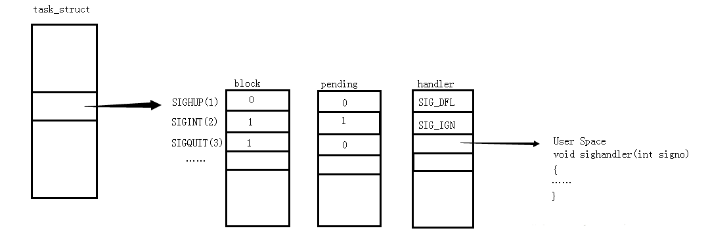

# 信号

## 5.1 引言

信号时软件中断。很多比较重要的应用程序都需处理信号。信号提供了一种处理异步事件的方法，例如，终端用户键入中断键，会通过信号机制停止一个程序，或及早终止管道中的下一个程序。

## 5.2 信号的概念

首先每个信号都有一个名字。这些名字都以3个字符SIG开头。在头文件signal.h中，所有信号都被定义为正整数常量（信号编号）。很多条件可以产生信号。

* 当用户按某些终端键时，引发中断产生信号。在终端上按Delete键（或者很多系统中的Ctrl+C键）通常产生中断信号（SIGINT）。这是停止一个失去控制程序的办法。
* 硬件异常产生信号：除数为0、无效的内存引用等。这些条件通常由硬件检测到，并通知内核，然后内核为该条件发生时正在运行的进程产生合适的信号。
* 进程调用kill（2）函数可以将任意信号发送给另一进程。
* 用户可用kill命令将信号发送给其他进程。
* 当检测到某种软件条件已经发生，并应将其通知有关进程时也产生信号。

信号时异步通信的经典实例。产生信号的事件对进程而言是完全独立的。进程不能简单地探测一个变量（如errno）来判断一个信号是否产生，而是必须告诉内核“在此信号发生时，请执行下列操作”。

当一个信号发生时，可以告诉内核按下列三种方式之一进行处理，我们称之为信号的处理或与信号相关动作。
1. 忽略此信号。大多数信号的处理方式，但是有两种信号不能被忽略。他们是SIGKILL和SIGSTOP。它们不能被忽略的原因是：它们像内核和超级用户提供了使进程终止或停止的可靠方法。
2. 捕捉信号。为了做到这一点，要通知内核在某种信号发生时，调用一个用户函数。在用户函数中，可执行用户希望对这件事件的处理。
3. 执行系统默认动作。注意，对大多数信号的系统默认动作是终止该进程。

在下列条件下不产生core文件：
1. 进程是设置用户ID的，并且当前用户并非程序文件的所有者；
2. 进程是设置组ID的，并且当前用户并非程序文件的组所有者；
3. 用户没有当前工作目录的权限；
4. 文件已存在，而且用户没有对该文件的写权限；
5. 文件太大。

### 5.2.1 信号编号

查看linux系统信号
```sh
    kill -l
```
||||||
----------|-------|--------|--------|---------
1) SIGHUP |2) SIGINT |3) SIGQUIT| 4) SIGILL |5) SIGTRAP
6) SIGABRT |7) SIGBUS |8) SIGFPE |9) SIGKILL |10) SIGUSR1
11) SIGSEGV |12) SIGUSR2 |13) SIGPIPE |14) SIGALRM |15) SIGTERM
16) SIGSTKFLT |17) SIGCHLD| 18) SIGCONT| 19) SIGSTOP| 20) SIGTSTP
21) SIGTTIN |22) SIGTTOU |23) SIGURG |24) SIGXCPU |25) SIGXFSZ
26) SIGVTALRM |27) SIGPROF |28) SIGWINCH |29) SIGIO |30) SIGPWR
31) SIGSYS| 34) SIGRTMIN |35) SIGRTMIN+1 |36) SIGRTMIN+2| 37) SIGRTMIN+3
38) SIGRTMIN+4 |39) SIGRTMIN+5 |40) SIGRTMIN+6 |41) SIGRTMIN+7 |42) SIGRTMIN+8
43) SIGRTMIN+9| 44) SIGRTMIN+10 |45) SIGRTMIN+11| 46) SIGRTMIN+12 |47) SIGRTMIN+13
48) SIGRTMIN+14 |49) SIGRTMIN+15| 50) SIGRTMAX-14 |51) SIGRTMAX-13| 52) SIGRTMAX-12
53) SIGRTMAX-11 |54) SIGRTMAX-10 |55) SIGRTMAX-9 |56) SIGRTMAX-8 |57) SIGRTMAX-7
58) SIGRTMAX-6 |59) SIGRTMAX-5| 60) SIGRTMAX-4 |61) SIGRTMAX-3| 62) SIGRTMAX-2
63) SIGRTMAX-1 |64) SIGRTMAX

### 5.2.2 信号机制

man 7 signal

Term Default action is to terminate the process.
Ign Default action is to ignore the signal.
Core Default action is to terminate the process and dump core (see core(5)).
Stop Default action is to stop the process.
Cont Default action is to continue the process if it is currently stopped.
First the signals described in the original POSIX.1-1990 standard.

Signal Value Action Comment

|||||
----|---|---|-----
SIGHUP |1 |Term| Hangup detected on controlling terminal or death of controlling process
SIGINT |2| Term| Interrupt from keyboard
SIGQUIT |3 |Core |Quit from keyboard
SIGILL| 4 |Core |Illegal Instruction
SIGABRT| 6| Core| Abort signal from abort(3)
SIGFPE |8| Core| Floating point exception
SIGKILL |9 |Term |Kill signal
SIGSEGV |11 |Core| Invalid memory reference
SIGPIPE |13 |Term| Broken pipe: write to pipe with no readers
SIGALRM |14| Term| Timer signal from alarm(2)
SIGTERM| 15| Term| Termination signal
SIGUSR1 |30,10,16 |Term| User-defined signal 1
SIGUSR2 |31,12,17| Term| User-defined signal 2
SIGCHLD |20,17,18| Ign |Child stopped or terminated
SIGCONT |19,18,25 |Cont| Continue if stopped
SIGSTOP| 17,19,23| Stop| Stop process
SIGTSTP |18,20,24 |Stop |Stop typed at tty
SIGTTIN| 21,21,26 |Stop |tty input for background process
SIGTTOU |22,22,27| Stop| tty output for background process
The signals SIGKILL and SIGSTOP cannot be caught, blocked, or ignored.

表中第一列是各信号的宏定义名称，第二列是各信号的编号，第三列是默认处理动作:

Term表示终止当前进程。

Core表示终止当前进程并且Core Dump（Core Dump 用于gdb调试）。

Ign表示忽略该信号。

Stop表示停止当前进程。

Cont表示继续执行先前停止的进程。

表中最后一列是简要介绍，说明什么条件下产生该信号。

###  5.2.3 信号产生种类

####  终端特殊按键

+ ctl+c SIGINT
+ ctl+z SIGTSTP
+ ctl+\ SIGQUIT

####  硬件异常
* 除0操作
* 访问非法内存

### 5.2.4  信号产生的原因

* SIGHUP：当用户推出shell时，由该shell启动的所有进程将收到这个信号，默认动作为终止进程
* SIGINT：当用户按下<Ctrl+C>组合键时，用户终端向正在运行中的由该终端启动的程序发送此信号。默认动作为终止进程。

### 5.2.5  进程处理信号行为

manpage里信号3种处理方式：

+ SIG_IGN
+ SIG_DFL
+ a signal handling function

进程处理信号的行为：

1. 默认处理动作

	term

	core

		gcc -g file.c
		ulimit -c 1024
		gdb a.out core
		进程死之前的内存情况，进程异常退出时检查

	ign

	stop

	cont

2.忽略

3.捕捉（用户自定义信号处理函数）

## 5.3 函数signal

UNIX系统信号机最简单的接口是signal函数。
```c
    #include <signal.h>

    typedef void (*sighandler_t)(int);

    sighandler_t signal(int signum, sighandler_t handler);
```
signal将signum传递给handler，handler可以是常量SIG_IGN、SIG_DFL或者一个接收到此信号后要调用的函数地址。如果指定SIG_IGN，则向内核表示忽略此信号。如果指定SIG_DFL，则表示接到此信号后的动作是系统默认动作。当指定函数地址时，则在信号发生时，调用该函数，我们称这种处理为捕捉函数，称此函数为信号处理程序或信号捕捉函数。

## 5.4 不可靠信号

在早期UNIX版本中，信号是不可靠的，不可靠在这里是指，信号可能会丢失：一个信号发生了，但进程可能一直不知道这一点。同时，进程对信号的控制能力也很差，它能捕捉信号或忽略它。有时用户希望通知内核阻塞某个信号：不要忽略该信号，在其发生时记住它，然后在进程做好准备时在通知它。这种阻塞信号的能力当时并不具备。

## 5.5 中断系统调用

早期UNIX系统的一个特性是：如果进程在执行一个低速系统调用而阻塞期间捕捉到一个信号，则该系统调用就被中断了不能继续执行。该系统调用返回出错，其errno设置为EINTR。这样处理是一个信号发生了，进程捕捉到它，这意味着已经发生了某种事情，所以是一个好机会唤醒阻塞的系统调用。

为了支持这种特性，将系统调用分为两类：低速系统调用和其他系统调用。低速系统调用是可能使进程永远阻塞的一类调用，包括：

* 如果某些文件类型（如读管道、终端设备和网络设备）的数据不存在，读操作可能会使调用者永远阻塞；
* 如果数据不能被相同的文件类型立即接受（如管道中无空间、网络流控制），写操作可能会使调用者永远阻塞；
* 在某些条件发生前打开某些文件类型可能发生阻塞（如要打开一个终端设备，需要先等待与之连接的调制解调器应答，又如若以只写模式打开FIFO，那么在没有其他进程已用读模式打开该FIFO时也要等待）；
* 对已经加上强制性记录锁的文件进行读写；
* pause函数（按照定义，它使调用进程休眠直至捕捉到一个信号）和wait函数；
* 某些ioctl操作；
* 某些进程间通信函数。

## 10.6 可重入函数

进程捕捉到信号并对其进行处理时，进程正在执行的正常之灵就被信号处理程序临时中断，它首先执行该信号处理函数的指令。如果从信号处理函数返回（假如没有调用exit或longjmp），则继续执行在捕捉信号时进程正在执行的正常指令序列（这类似于发生硬中断时所做的）。但在信号处理程序中，不能判断捕捉信号时执行到何处。

Single UNIX Specification说明了在信号处理程序中保证调用安全的函数。这些函数是可重入的并成为是异步信号安全的。除了可重入之外，在信号处理操作期间，它会阻塞任何会引起不一致的信号发送。大多数函数是不可重入的，因为（a）已知它们使用静态结构；（b）它们调用malloc或者free；（c）它们是标准I/O函数。标准I/O库的很多实现都以不可重入方式使用全局数据结构。

可重入：可重新进入函数

* 不含全局变量和静态变量是可重入函数的一个要素
* 可重入函数见man 7 signal
* 在信号捕捉函数里面应该使用可重入函数
* 在信号捕捉函数里禁止调用不可重入函数

例如：`strtok`就是一个不可重入函数，因为`strtok`内部维护了一个内部静态指针，保存上次切割到的位置，如果信号的捕捉函数中也调用了`strtok`函数，则会造成切割字符串混乱，应用`strtok_r`版本，r表示可重入。

	#include <stdio.h>
	#include <string.h>
	
	int main(void)
	{
		char buf[] = "hello world";
		char *save = buf, *p;
	
		while((p = strtok_r(save, " ", &save))!= NULL)
			printf("%s\n", p);

		return 0;
	}

## 5.7 SIGCLD语义

SIGCLD和SIGCHLD两个信号容易混淆。SIGCLD是System V的一个信号名，其语义与名为SIGCHLD的BSD信号不同。

如果进程明确的将该信号配置设置为SIG_IGN，则调用进程的子进程将不产生僵死进程。注意，这与其默认动作（SIG_DFL）“忽略”不同，子进程在终止时，将其状态丢弃。如果进程随后调用一个wait函数，那么它将阻塞直到所有子进程都终止，然后wait会返回-1，并将其errno设置成为ECHILD。

如果SIGCLD的配置设置为捕捉，则内核立即检查是否有子进程准备好等待，如果是这样，则调用SIGCLD处理程序。

SIGCHLD信号处理

* 子进程终止时
* 子进程接收到SIGCHLD信号停止时
* 子进程处在停止态，接收到SIGCHLD后唤醒时

status处理方式
```c
	pid_t waitpid(pid_t pid, int *status, int options)
	options
		WNOHANG
			没有子进程结束，立即返回
		WUNTRACED
			如果子进程由于被停止产生的SIGCHLD， waitpid则立即返回
		WCONTINUED
			如果子进程由于被SIGCONT唤醒而产生的SIGCHLD， waitpid则立即返回
	获取status
		WIFEXITED(status)
			子进程正常exit终止，返回真
				WEXITSTATUS(status)返回子进程正常退出值
		WIFSIGNALED(status)
			子进程被信号终止，返回真
				WTERMSIG(status)返回终止子进程的信号值
		WIFSTOPPED(status)
			子进程被停止，返回真
				WSTOPSIG(status)返回停止子进程的信号值
		WIFCONTINUED(status)
			子进程由停止态转为就绪态，返回真
```
举例：
```c
	#include <stdio.h>
	#include <signal.h>
	#include <stdlib.h>
	#include <unistd.h>
	#include <errno.h>
	#include <wait.h>
	#include <sys/types.h>
	
	void do_sig_child(int signo){
	/*      while(!(waitpid(0, NULL, WNOHANG)== -1))
	        ;
	*/
	        int status;
	        pid_t pid;
	
	        while(waitpid(0, &status,WNOHANG)>0){
	                if(WIFEXITED(status))
	                        printf("child %d exit %d\n",pid, WEXITSTATUS(status));
	                else if(WIFSIGNALED(status))
	                        printf("child %d cancle signal %d\n", pid, WTERMSIG(status));
	}
	}
	void sys_err(char *str)
	{
	        perror(str);
	        exit(1);
	}
	
	int main(void){
	        pid_t pid;
	        int i;
	        for (i = 0; i< 10; i++)
	        {
	                if((pid = fork()) == 0)
	                        break;
	                else if(pid< 0)
	                        sys_err("fork");
	        }
	
	        if(pid == 0) {
	        int n = 3;
	        while(n --) {
	                printf("child ID %d\n", getpid());
	                sleep(1);
	                }
	        return i;
	        }
	        else if(pid > 0){
	        struct sigaction act;
	        act.sa_handler = do_sig_child;
	        sigemptyset(&act.sa_mask);
		act.sa_flags = 0;
	
	        sigaction(SIGCHLD, &act, NULL);
	        while(1) {
	                printf("parent ID %d\n", getpid());
	                sleep(1);
	                }
	        }
	
	}
```

5.8 可靠信号术语和语义

我们需要先定义一些在讨论信号时会遇到的术语。首先，当造成信号的事件发生时，为进程产生一个信号（或向进程发送一个信号）。事件可以是硬件异常（如除以0）、软件条件（如alarm定时器超时）、终端产生的信号或调用kill函数。当一个信号产生时，内核通常在进程表中以某种形式设置一个标志。当对信号采取了这种动作时，我们说向进程递送了一个信号。在信号产生和递送时间间隔内，称信号时未决的。

进程可以选用“阻塞信号递送”。如果为进程产生了一个阻塞的信号，而且对该信号的动作是系统默认动作或捕捉该信号，则为该进程将此信号保持为未决状态，直到该进程解除了阻塞，或者将对此信号的动作改为忽略。内核在递送一个原来被阻塞的信号给进程时（而不是在产生该信号的时），才决定对它的处理方式。于是进程在信号递送给它之前仍然可改变对该信号的动作。进程调用sigpending函数来判定那些信号是设置为阻塞并处于未决状态的。

## 5.9 函数kill和raise

kill函数可以将信号发送给进程或者进程组。raise函数则允许进程向自身发信号。

```c
    #include <sys/types.h>
    #include <signal.h>

    int kill(pid_t pid, int sig);
    int raise(int sig);				//自己向自己发送信号
```
调用

raise(sig);

等价于调用

kill(getpid(), sig);

不过，kill向调用者返回测试结果时，原来存在的被测试结果可能刚终止

kill的pid参数可能有以下4中不同的情况：

	pid > 0
    	sig发送给ID为pid的进程
    pid == 0
    	sig发送给与发送进程同组的所有进程（这些进程的进程组ID等于未发送进程的组ID，而且发送进程具有权限向这些这些进程发送信号。这里用的术语“所有进程”不包括实现定义的系统进程集。对于绝大多数UNIX系统，系统进程包括内核进程和init（pid为1）
    pid < 0
    	sig发送给组ID为|-pid|的进程，并且发送进程具有向起发送信号的权限。如前说述，所有进程不包括系统进程集中的进程。
    pid == -1
    	sig发送给发送进程有权限向他们发送信号的系统上的所有进程

sig为0时，用于检测，特定的pid进程是否存在，返回-1，对权限进行测试时也有一个特例：如果被发送的信号时SIGCONT，则进程可将它发送给属于通一会话的任一其他进程。

### 5.10 函数alarm和pause

使用`alarm`函数可以设置一个定时器（闹钟时间），如果在将来某个时刻该定时器会超时。当定时器`alarm`到时时，进程向自己发送`SIGALRM`信号。如果忽略或不捕捉此信号，其默认动作是终止调用该alarm函数的进程。每个进程**只有一个定时器**

```c  
    unsigned int alarm(unsigned int seconds)	//返回值为未到达的秒数，到达设定时间后返回SIGALRM信号
```
如果在调用alarm时，之前已为该进程注册的闹钟时间还没超时，则该闹钟的剩余值作为本次alarm函数调用的值返回。以前注册的脑中时间则被新值替换。

如果有以前注册的尚未超过的闹钟时间，而且本次调用seconds是0，则取消以前闹钟时间，其余留值仍作为alarm函数的返回值。

虽然SIGALRM的默认动作是终止进程，但是大多数使用闹钟的进程捕捉此信号。如果进程要终止，则在终止前它可以执行所需的清理操作。如果我们想捕捉SIGALRM信号，则必须在调用alarm之前安装该信号的处理程序。如果我们先调用alarm，然后我们能够安装SIGALRM处理程序之前已接收到该信号，那么进程将终止。

例：
```c
    #include <unistd.h>
    #include <stdio.h>
    
    int main(void){
    int counter;
    alarm(1);
    for(counter = 0; 1; counter++)
    	printf("counter = %d \n", counter);
    return 0;
    }
```

pause函数使调用进程挂起知道捕捉到一个信号。
```c
    #include <unistd.h>

    int pause(void);
```
只有执行了一个信号处理程序并从其返回时，pause才返回。在这种情况下，pause返回-1，errno设置为EINTR。

## 5.11  信号集处理函数

我们需要有一个能表示多个信号——信号集的数据类型。我们将在sigprocmaks（下一节中说明）类函数中使用这种数据类型，以便告诉内核不允许产生该信号集中的信号。如前所述，不同的信号的编号可能超过一个整形量所包含的位数，所以一般而言，不能用整形量中的一位代表一种信号，也就不能用一个整形量表示一个信号集。POSIX.1定义数据类型sigset_t以包含一个信号集，并且定义了下列5个处理信号集函数，可sizeof(sigset_t)查看

```c
	#include <signal.h>
    int sigemptyset(sigset_t *set)	//信号集全部置0
    int sigfillset(sigset_t *set)	//信号集全部置1
    int sigaddset(sigset_t *set, int signo)	//某一位置0或置1
    int sigdelset(sigset_t *set, int signo)
	//四个函数返回值：若成功，返回0，；若出错，返回-1
    int sigismember(const sigset_t *set, int signo)
	//返回值：若真，返回1；若假，返回0
```
函数sigemptyset初始化由set指向的信号集，清除其中所有信号。函数sigfillset初始化set指向的信号集，使其包括所有信号。所有应用程序在使用信号集前，要对该信号集调用sigemptyset或sigfillset一次。这是因为C编译程序并不将不赋初值的外部变量和静态变量都初始化为0，而这是否给系统上信号集的实现相对应却并不清楚。

一旦已经初始化了一个信号集，以后就可以在该信号集中增、删响应信号。函数sigaddset将一个信号添加到已有的信号集中，sigdelset则从信号集中删除一个信号。对所有以信号集作为参数的函数，总是以信号集地址作为向其传送的参数。

PCB信号集

<center>



信号在内核中的表示示意图

</center>
如果在进程解除对某信号的阻塞之前这种信号产生多次，将如何处理？POSIX.1允许系统传递该信号一次或者多次。Linux是这样实现的：常规信号在递达之前产生多次只记一次，而实时信号在递达之前产生多次可以依次放在一个队列里面。本章不讨论实时信号。而从上图来看，一个信号只有一个bit的未决标志，非0即1，不记录该信号产生了多少次，阻塞标志也是这样表示的。因此，未决和阻塞标志可以使用相同的sigset_t来储存，sigset_t也被称作信号集，这个类型可以表示每个信号的“有效”和“无效”状态，在未决信号集中，“有效”和“无效”的含义是该信号是否处于未决状态；而在阻塞信号集中，“有效”和“无效”的含义是该信号是否被阻塞。

阻塞信号集也叫做当前进程的信号屏蔽字（Signal Mask)，这里的屏蔽应理解为阻塞而不是忽略。

未决态：信号产生，但没被响应

递达态：信号产生并被响应

PEND未决信号集合|Block阻塞信号集合
-----------|-----------
用户不可设置，内核自动设置，用户可读 | 用户可以设置

## 5.12 函数sigprocmask

5.8节曾提及一个进程的信号屏蔽字规定了当前阻塞而不能传递给该进程的信号集。调用函数`sigprocmask`可以读取或更改，或者同时检测或更改进程的信号屏蔽字。
```c
	#include <signal.h>
	
	int sigprocmask(int how, const sigset_t *set, sigset_t *oset);
	//返回值：若成功则为0，若出错则为-1
```
首先，如果oset是非空指针，则读取进程当前信号屏蔽字并通过oset参数传出。

其次，如果set是非空指针，则更改进程的信号屏蔽字，参数how指示如何修改。

如果set是个空指针，则不改变任何进程的信号屏蔽字，how的值也毫无意义。

如果oset和set都是非空指针，则先将原来的信号屏蔽字备份到oset里，然后根据set和how参数更改信号屏蔽字。假设当前的信号屏蔽字为mask，下表说明了how参数的可选值。

how参数的含义

	SIG_BLOCK	set包含了我们希望添加到当前信号屏蔽字里的信号，相当于mask=mask|set
	SIG_UNBLOCK	set包含了我们希望从当前屏蔽字中解除阻塞的信号，相当于mask=mask&~set
	SIG_SETMASK	设置当前信号屏蔽字为set所指向的值，相当于mask=set

如果调用`sigprocmask`解除了对当前若干个未决信号的阻塞，有任何未决的、不再阻塞的信号到达，则在`sigprocmask`返回前，至少将其中一个信号递达。

## 5.13 函数sigpending
sigpending函数返回一个信号集，对于调用进程而言，其中的各信号是阻塞不能递送的，因而也不一定是当前未决的。该信号集通过set参数返回。
```c
	#include <signal.h>
	
	int sigpending(sigset_t *set);
	//返回值：若成功，返回0，若出错，返回-1
```

`sigpending`用于读取当前进程的未决信号集，通过`set`参数导出。

下面用上面的函数做个实验。
```c
	#include <signal.h>
	#include <stdio.h>
	
	void printsigset(const sigset_t *set)
	{
		int i;
		for(i = 1; i < 32; i++)
			if(sigismember(set, i ) == 1)
				putchar('1');
			else
				putchar('0');
		puts("");  
	}
	
	int main(void){
		sigset_t s, p;
		sigemptyset(&s);
		sigaddset(&s, SIGINT);
		sigprocmask(SIG_BLOCK, &s, NULL);
		while(1) {
			sigpending(&p);
			printsigset(&p);
			sleep(1);
		}
		return 0;
	}
```

## 5.14 函数sigaction

sigaction函数的功能是检查或修改与指定信号相关联的处理动作。此函数取代了UNIX早起版本使用signal函数。
```c
    #include <signal.h>

    int sigaction(int signum, const struct sigaction *act,
                  struct sigaction *oldact);
```
其中，参数signo是要检测或修改其具体动作的信号编号。若act指针非空，则要修改其动作。如果oldact指针非空，则系统经由oldact指针返回上移动作。此函数使用下列结构。
```c
    struct sigaction {
        void     (*sa_handler)(int);
        void     (*sa_sigaction)(int, siginfo_t *, void *);
        sigset_t   sa_mask;
        int        sa_flags;
        void     (*sa_restorer)(void);
    };
```
	sa_handler : 早期的捕捉函数
	sa_sigaction : 新添加的捕捉函数，可以传参，和sa_handler互斥，两者通过sa_flags选择采用哪种捕捉函数
	sa_mask : 在执行捕捉函数时，设置阻塞其他信号，sa_mask | 进程阻塞信号集，退出捕捉函数后，还原回原有的阻塞信号集
	sa_flags : SA_SIGINFO 或者0
	sa_restorer : 保留，已过时

举例SA_SIGINT被捕捉：

当前进程从内核返回用户空间代码前检查是否有信号递达，有则去响应。

## 5.15 函数sigsetjmp和siglongjmp

之前说明了非局部转移的setjmp和longjmp函数。在信号处理程序中经常调用longjmp函数以返回到程序的主循环中，而不是从该处理函数返回。

但是，调用longjmp有一个问题，当捕捉到一个信号时，进入信号捕捉函数，当时当前信号被自动地加到进程的信号屏蔽字中。这阻止了后来产生的这种信号中断该信号处理程序。如果用longjmp跳出信号处理程序，那么对此进程的信号屏蔽字会发生什么呢？

为了允许两种形式并存，POSIX并没有指定setjmp和longjmp对信号屏蔽字的作用，而是定义了两个新函数sigsetjmp和siglongjmp。在信号处理程序中进行非局部转移时应当使用这两个函数。

```c
    #include <setjmp.h>

	int sigsetjmp(sigjmp_buf env, int savesigs);
	void siglongjmp(sigjmp_buf env, int val);
```
这两个函数和setjmp、longjmp之间唯一的区别是sigsetjmp增加了一个参数。如果savemask非0，则sigsetjmp在env中保存进程当前信号屏蔽字。调用siglongjmp时，如果带非0savemask的sigsetjmp调用已经保存了env，则siglongjmp从其中恢复保存的信号屏蔽字。

## 5.16 函数sigsuspend

上面已经说明，更改进程的信号屏蔽字可以阻塞所选择的信号，好解除对它们的阻塞。使用这种方法可以保护不希望由信号中断的代码临界区。如果希望对一个信号解除阻塞，然后pause以等待以前被阻塞的信号发生，则又将如何？假定信号是SIGINT，实现这一点的一种不正确方法是：
```c
	sigset_t	newmask, oldmask;
	sigemptyset(&newmask);
	sigaddset(&newmask, SIGINT);
	if(sigprocmask(SIG_BLOCK, &newmask, &oldmask) < 0)
		err_sys("SIG_BLOCK error");
	if(sigprocmask(SIG_SETMASK, &oldmask, NULL)< 0)
		err_sys("SIG_SETMASK error");
	pause();
```
如果在信号阻塞时产生了信号，那么该信号的传递就被推迟直到解除对它的阻塞。对应用程序而言，该信号好像发生在解除对SIGINT的阻塞和pause之间（取决于内核如何实现信号）。如果发生了这种情况，或者如何在解除阻塞时刻和pause之间确实发生了信号，那么就会产生问题。因为可能不会再见到该信号，所以从这种意义上来讲，在此时间发生的信号丢失了。这样会使pause永远阻塞。

为了纠正这个问题，需要在一个原子操作中先恢复信号屏蔽字，然后使进程休眠。这种功能是由sigsuspend函数所提供的。
```c
    #include <signal.h>

    int sigsuspend(const sigset_t *mask);
	//返回值：-1，并将errno设置为EINTR
```
进程的信号屏蔽字设置为由sigmask指向的值。在捕捉到一个信号或发生一个会终止该进程的信号前，该进程会被挂起。如果捕捉到一个信号而且从该信号处理程序返回，则sigsuspend返回，并且该进程的信号屏蔽字设置为调用sigsuspend之前的值。

sigsuspend的另一个应用是等待一个信号处理程序设置一个全局变量。**利用此性质实现父子进程同步。**

避免异步I/O的类型

sig_atomic_t		//平台下的原子类型

volatile			//防止编译器开启优化选项时，优化对内存的读写

## 5.17 函数abort

除此之外还有`abort`函数，功能是使程序异常终止。
```c
    void abort(void)	//调用进程向自己发送SIGABRT信号
```
此函数将SIGABRT信号发送给调用进程（进程不应忽略此信号）。让进程捕捉SIGABRT的意图是：在进程终止之前由其执行所需的清理操作。如果进程并不在信号处理程序中终止自己，POSIX.1声明当信号处理程序返回时，abort终止该进程。

## 5.18 函数system

之前章节中已经有了以个system函数的实现，但是并没有执行任何信号处理。POSXI.1要求system忽略SIGINT和SIGQUIT，阻塞SIGCHLD。

注意system的返回值，它使shell的终止状态，但shell的终止状态并不总是执行命令字符串进程的终止状态。

## 5.19 函数sleep、nanosleep和clock_nanosleep

本书的很多例子都使用了sleep函数，但它们都是有缺陷的。
```c
    #include <unistd.h>

    unsigned int sleep(unsigned int seconds);
	//返回值：0或未休眠完的秒数
```
此函数使调用进程挂起直到满足下列两个条件之一：
* 已经过了seconds所指的墙上时钟时间。
* 调用进程捕捉到一个信号并从信号处理函数返回。

如同alarm函数一样，由于其他系统活动，实际返回时间比所要求的会迟一点。

尽管sleep可以用alarm实现，但是并不是必需的。如果使用alarm，则这两个函数之间可能互相影响。
```c
    #include <time.h>

    int nanosleep(const struct timespec *req, struct timespec *rem);
    int clock_nanosleep(clockid_t clock_id, int flags,
                        const struct timespec *request,
                        struct timespec *remain);
```

注意：子进程继承了父进程的信号屏蔽字和信号处理动作。

### 5.10.1  sigqueue

在前面的章节中，我们介绍了大部分UNIX系统不对信号排队。在POSIX.1的实时扩展中，有些系统开始增加对信号排队的支持。通常一个信号带有一个位信息：信号本身。除了信号排队外，这些扩展允许应用程序在递交信号时传递更多的信息。这些信息嵌在siginfo中。
```c
	int sigqueue(pid_t pid, int sig, const union sigval value)
	
	union sigbal{
		int sival_int;
		void *sival_ptr;
	}
```
sigqueue函数只能把信号发送给单个进程，可以使用value参数向信号处理程序传递整数和指针值，除此之外，sigqueue函数与kill函数类似。信号不会被无限排队，到达相应的限制后，sigqueue会失败，将errno设置为EAGAIN。


## 信号引起的竟态和异步I/O

### 时序竟态

	int pause(void)
		使用进程挂起，直到有信号递达，如果递达信号是忽略，则继续挂起
	int sigsuspend(const sigset_t *mask)
		以通过制定mask来临时解除对某个信号的屏蔽；
		然后挂起等待；
		当sigsuspend返回时，进程的信号屏蔽字恢复为原来的值

`mysleep`实现，这种方式是否存在BUG？

	#include <stdio.h>
	#include <signal.h>
	
	int mysleep(int n)
	{
		signal(SIGALRM, do_sig);
		alarm(n);	//定时n秒
		pause();
	}
	void do_sig(int n)
	{
		
	}
	
	int main(void)
	{
		struct sigaction act;
	
		//act.sa_handler = do_sig;
		//act.sa_handler = SIG_IGN;
		act.sa_handler = SIG_DFL;
		sigemptyset(&act.sa_mask);
		act.sa_flags = 0;
	
		sigaction(SIGUSR1, &act, NULL);
	
		pause();
	
		return 0;
	}