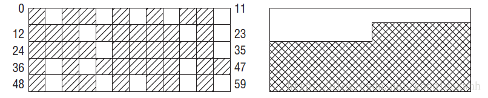

## 内存管理

### 引言

**《深入理解Linux内核第三版》**

在之前的章节中介绍了Linux如何有效利用80×86的分段和分页单元把逻辑地址转换为物理地址。我们还提到RAM的有些部分永久地分配给内核，并用来存放内核代码以及静态内核数据结构。

RAM的其他部分被称之为动态内存（dynamic memory)，这不仅是进程所需的宝贵资源，也是内核本身所需的宝贵资源。实际上，整个系统的性能取决于如何有效的管理动态内存，因此，现在所有多任务操作系统都在尽力优化对动态内存的使用，也就是说，尽可能做到当需要时分配，不需要时释放。本章主要通过三个部分内容描述内核如何给自己分配动态内存。“页框管理”和“内存区管理”两节分别介绍对连续物理内存区处理的两种不同技术，而“非连续内存区管理”一节介绍了非连续物理内存区的第三种技术。在这几节中我们的主题设计诸如内存管理区，内核映射、伙伴系统、slab高速缓存和内存池。

### 伙伴系统算法

内核应该为分配一组连续的页框而建立一种健壮、高效的分配策略。为此，必须解决著名的内存管理问题，也就是所谓的页外碎片（external fragmentation）。频繁地请求和释放不同大小的一组连续页框，必然导致已分配的页框的块内分散了许多小块的空闲页框。由此带来的问题是，即使有足够的空闲页框可以满足请求，但要分配一个大块连续的页框就不能满足，如图所示：

内存碎片演示

这时虽然可用内存页还有很多，但是最大的连续物理内存也只有一页，这对于用户程序不成问题，因为用户程序通过页表映射，应用程序看到的总是连续的虚拟内存。但是对于内核来说就不行了，因为内核有时候需要使用连续的物理内存。

从本质上来说，避免外碎片的方法有两种：

* 利用分页单元把一组非连续的空闲页框映射到连续的线性地址区间。
* 开发一种适当的技术来记录现存的空闲连续页框块的情况，以尽量避免为满足对小块的请求而分割大的空闲块。

基于以下三种原因，内核首选第二种方法：

* 在某些情况下，连续的页框确实是必须的，因为连续的闲心改地址不足以满足请求。一个典型的例子就是给DMA处理器分配缓冲区的内存请求。因为当一次单独的I/O操作中传送几个磁盘扇区的数据时，DMA忽略分页单元而直接访问地址总线，因此，所请求的缓冲区必须位于连续的页框中。
* 即使连续页框的分配并不是很必要，但它在保持内核页表不变方面所起的作用也是不容忽视的。修改页表会怎样，我们之前章节已经说过，频繁地修改页表必然导致平均访问内存次数增加，因为这会使CPU频繁地刷新转换后援缓冲器（TLB）的内容。
* 内核通过4MB的页可以访问大块连续的物理内存。这样减少了转换后援缓冲器的失效率，因此提高了访问内存的平均速度。

2 linux 伙伴系统的提出 

Linux内核中引入了伙伴系统算法(buddy system)。把所有的空闲页框分组为11个块链表，每个块链表分别包含大小为1，2，4，8，16，32，64，128，256，512和1024个连续页框的页框块。最大可以申请1024个连续页框，对应4MB大小的连续内存。每个页框块的第一个页框的物理地址是该块大小的整数倍。例如，大小为16个页框的块，其起始地址是16*2^12（2^12=4096）的整数倍。

假设要申请一个256个页框的块，先从256个页框的链表中查找空闲块，如果没有，就去512个页框的链表中找，找到了则将页框块分为2个256个页框的块，一个分配给应用，另外一个移到256个页框的链表中。如果512个页框的链表中仍没有空闲块，继续向1024个页框的链表查找。如果1024块存在，则将其中的256页框作为请求返回，剩余的768分成256块和512块分别插到相应的链表中。如果仍然没有，则返回错误。

<<<<<<< HEAD
以上过程的逆过程就是块的释放过程，这也是该算法名字的来由。满足以下条件的两个块称之为伙伴：

* 两个块的大小相同
* 两个块的物理地址连续

伙伴算法把满足以上条件的两个块合并为一个块，该算法是迭代算法，如果合并后的块还可以跟相邻的块进行合并，那么该算法就继续合并。
=======
以上过程的逆过程就是块的释放过程，这也是该算法名字的来由。内核视图把一个大小为b的一对空闲伙伴合并为一个大小为2b的单独块。满足以下条件的两个块称之为伙伴：

* 两个块的大小相同，记做b。
* 两个块的物理地址连续。
* 第一块的第一个页框的物理地址是2×b×2^12的倍数。

该算法是迭代算法，如果它成功合并释放的块，它会尝试合并2b的块，以再次试图形成更大的块。
>>>>>>> 170865e... deep into the kernel about memory management

